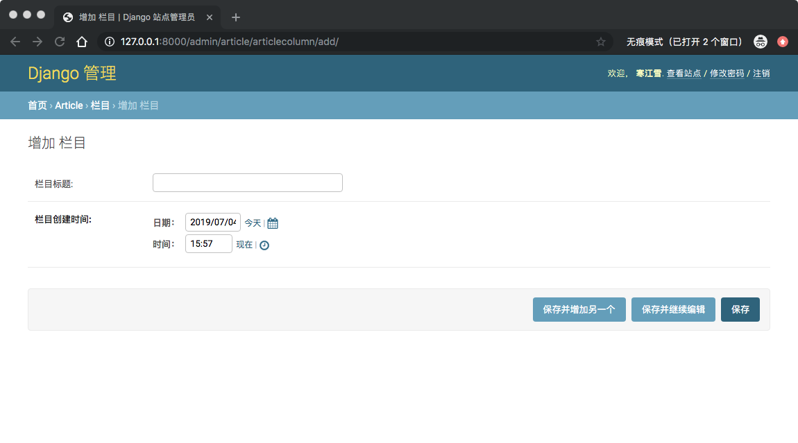
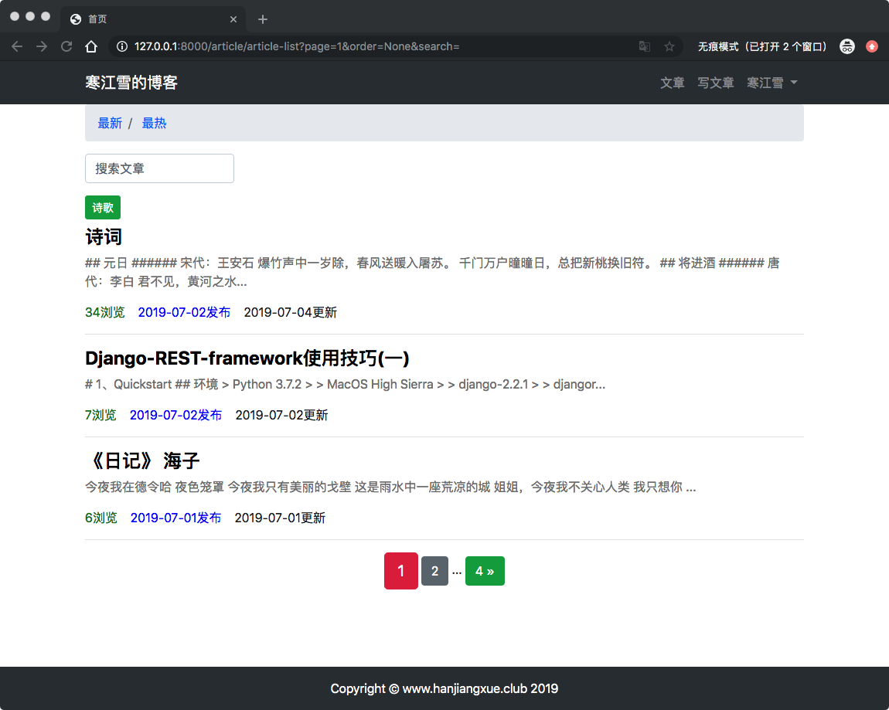
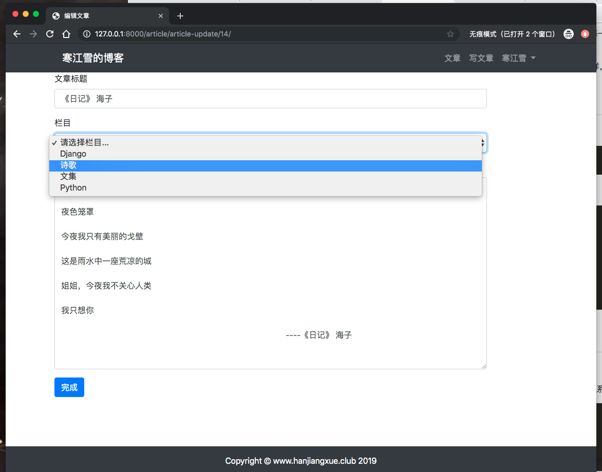
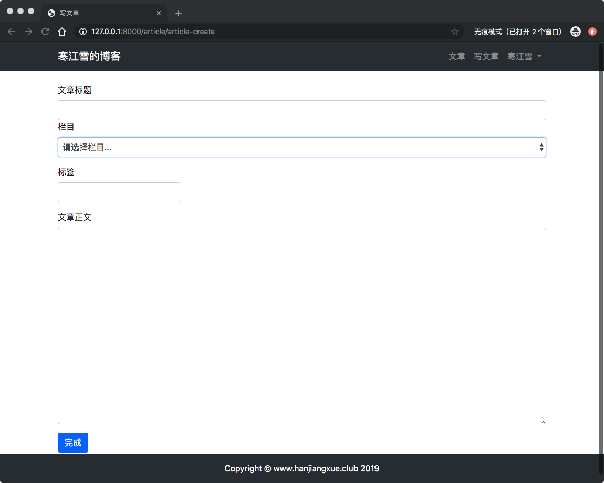
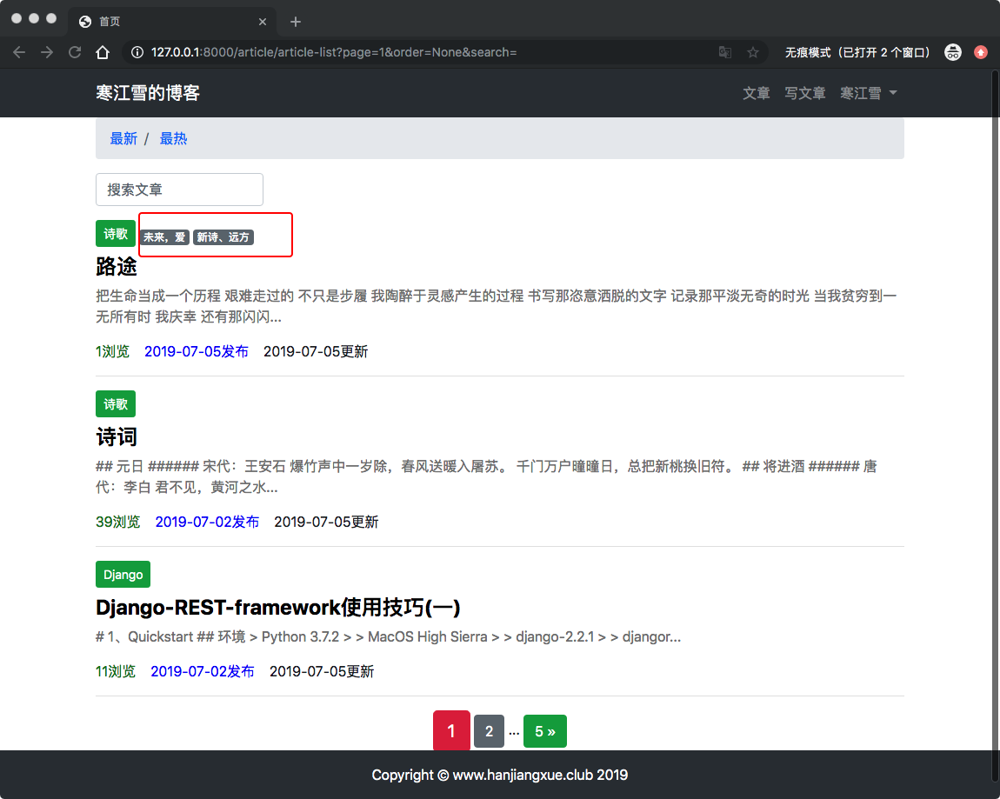

# 14、博客网站搭建十四(文章栏目、文章标签)

## 14.1 设置文章栏目
博客的文章类型通常不知一种，有时候你除了写一些技术文章，还会写一些诗歌，影评，或者仅仅是个记录。

因此对文章的分类就显得相当重要了，既方便博主对文章进行分类归档，也方便用户有针对性的去阅读。

## 栏目的模型
实现文章栏目功能的方法有很多种，你可以只是简单的在文章的model中增加`CharField()`字段，以字符串的形式将栏目的名称保存起来，这个实现更像是一个标签。

这样做的优点是比较简单，缺点是时间长了可能就会混淆栏目名字，也不方便对栏目的其他属性进行扩展。

因为上面我们已经说了**基于类的视图了**后面，我们写都会用基于类的视图，以前写好的，还是那句话，先造好车，在去换优质的发动机。

进入`article/models.py`：

```
# 栏目的model
class ArticleColumn(models.Model):
    # 栏目标题
    title = models.CharField(max_length=200, blank=True, verbose_name='栏目标题')
    # 创建时间
    created = models.DateTimeField(default=timezone.now, verbose_name='栏目创建时间')

    def __str__(self):
        return self.title

    class Meta:
        verbose_name = '栏目'
        verbose_name_plural = '栏目'
        
# 博客文章数据模型
class ArticlePost(models.Model):
...
...
  # 文章栏目"一对多"外键
    column = models.ForeignKey(ArticleColumn, null=True, blank=True, on_delete=models.CASCADE, 
    									related_name='article',
    									verbose_name='栏目')
...    									
```
> 记得修改Model后要迁移数据

## 列表显示栏目
模型写好之后，需要几条数据来进行测试，由于还没有写视图，所以利用Django自带后台，首先把栏目模型注册到后台：

进入`article/admin.py`：

```
from .models import ArticlePost, ArticleColumn

...

# 注册文章栏目到admin中
admin.site.register(ArticleColumn)
```
然后就可以在后台添加栏目数据了：




添加几个栏目之后，在后台打开一片文章，可以看到栏目选择：


## 重写文章列表

之前UI展示用的是卡片类型的，随着数据的增多，卡片已经不那么好用了，因此这里重写`list.html`文件：

```
     <div class="row mt-2">

          

{#            文章内容#}
           <div class="col-12">

{#                栏目#}
               
                   <button type="button" class="btn btn-sm mb-2 btn-success">{{ article.column }}</button>
               

{#             卡片容器#}

{#                   标题#}
               <h4 >
                   <b>
                       <a href="" style="color: black">{{ article.title }}</a>
                   </b>
               </h4>
{#                    摘要#}
               <div >
                   <p style="color: gray">{{ article.body|slice:'100' }}...</p>
               </div>
{#                    注脚#}

                <P>
{#                    附加信息#}
                    <span style="color: green">{{ article.total_views }}浏览&nbsp;&nbsp;&nbsp;</span>
                    <span style="color: blue">{{ article.created_time|date:'Y-m-d' }}发布&nbsp;&nbsp;&nbsp;</span>
                    <span style="color: -moz-mac-accentdarkestshadow">{{ article.update_time|date:'Y-m-d' }}更新</span>
                </P>
                <hr>
           </div>

          

      </div>
```


## 修改写文章功能
列表已经进本没问题了，但是发表新文章的时候还是不能选择栏目。进入`templates/article/create.html`,修改如下：

```
...
{#                文本栏目#}
                <div class="form-group">
                    <label for="column">栏目</label>
                    <select class="form-control" id="column" name="column">
                        <option value="none">请选择栏目...</option>
                        
                            <option value="{{ column.id }}">{{ column }}</option>
                        

                    </select>
                </div>
{#                文章正文#}
                <div class="form-group">
                ...
```
> `select`是表单的下拉选择组件，这个组件中循环列出所有栏目的数据，并且设置`value`属性，指定提交栏目的`id`值。

跟之前一样，能够展示了，但是还没有处理表单的视图逻辑。

进入`article/views.py`修改已有的写文章视图`article_create()`，让其能够处理表单上传的栏目数据：

```
...
            # 此时请重新创建用户，并出入此用户的id
            new_article.author = User.objects.get(id=request.user.pk)
            
            # 新增修改
            if request.POST['column'] != 'none':
                new_article.column = ArticleColumn.objects.get(id=request.POST['column'])
            # 将文章保存到数据库中
            new_article.save()

            # 完成后返回文章列表
            return redirect('article:article_list')
        else:
            return HttpResponse('内容填写有误，请重新填写啦。')
    # 如果用户请求获取数据
    else:
        # 创建表单类实例
        article_post_form = ArticlePostForm()
        columns = ArticleColumn.objects.all() 新增修改
        # 赋值上下文
        context = {'article_post_form': article_post_form, 'columns':columns}
        ....
```
> 新增代码涉及get和post两部分：
> 
> * POST：主要考虑某些文章是可以没有栏目的。因此用if语句判断该文章是否有栏目，如果有，则根据表单提交的value值，关联对应的栏目。
> * GET：增加栏目的上下文，以便模板使用。

数显页面如下图：


## 修改更新视图
进入模板`templates/article/update.html`:

```
        <form method="post" action=".">
            

            <div class="form-group">
                <label for="title">文章标题</label>
{#                在value属性中指定文本框的初始值为旧的内容，即article对象中的title字段#}
                <input type="text" class="form-control" id="title" name="title" value="{{ article.title }}">
            </div>
{#            文章栏目#}
            <div class="form-group">
                <label for="column">栏目</label>
                <select class="form-control" id="column" name="column">
                    <option value="none">请选择栏目...</option>
                    
                        <option value="{{ column.id }}"
                        
                            selected
                         
                        >{{ column }}
                        </option>
                    
                </select>
                
            </div>
```

> 与前面稍有不同的是，表单中判断了column.id与article.column.id是否相等，如果相等则将其设置为默认值。

然后进入`article/viwes.py`:

```
        # 判断用户是否为POST表单提交数据
        if request.method == 'POST':
          ...
          ...
                article.title = request.POST['title']
                article.body = request.POST['body']
                
                # 新增
                if request.POST['column'] != 'none':
                    article.column = ArticleColumn.objects.get(id=request.POST['column'])
                else:
                    article.column = None
                
                article.save()
                # 完成之后返回到修改后的文章中，需要传入文章的id值
                return redirect('article:article_detail', pk=pk)
            # 如果不合法，返回错误信息
            else:
                return HttpResponse('表单数据内容有误，请重新填写。')

        # 如果用户是GET请求获取数据
        else:
		...
            新增
            columns = ArticleColumn.objects.all()
            # 赋值上下文。将article文章对象也传递进去，以便提取旧的内容
            context = {'article': article, 'article_post_form':article_post_form, 'columns':columns}
```
刷新页面，进入编辑文章：



栏目功能先到这里，以后功能性优化在说吧。

## 14.2 文章添加标签功能

”标签“是作者从文章中提取的核心词汇，其他用户可以通过标签快速了解文章的关注点。每个文章的标签可能都不一样，并且可以拥有多个标签，这是与栏目不同的。

标签有一个三方优秀的库：[`Django-taggit`](https://github.com/jazzband/django-taggit),也就是我们可以不用重复造轮子了。

## 安装配置

进入虚拟环境：

	(env) AdministratordeiMac:myblog administrator$ pip install django-taggit

安装成功后，添加注册：

```
INSTALLED_APPS = [
...
...
    'taggit',
]
```

## 修改文章模型

标签是文章的model模型，因此需要修改文章模型。

需要注意的是标签引用不是内置的字段，而是库中`TaggableManager`,它是处理多对多的的管理器,进入`article/models.py`:

```
# 博客文章数据模型
class ArticlePost(models.Model):

...
    # 文章标签
    tags = TaggableManager(blank=True)
...
```
> 记得迁移数据

## 发表带标签的文章
修改文章的表单类，让其鞥能够提交标签字段，进入`article/form.py`：

```
class ArticlePostForm(forms.ModelForm):
...
        # 定义表单包含的字段
        fields = ('title', 'body', 'tags')
```
然后修改发表文章，保存POST中的标签，进入`article/views.py`：

```
def article_create(request):
...
            # 将文章保存到数据库中
            new_article.save()
            
            # 保存tags 的多对多的关系
            article_post_form.save_m2m()
...
```
> 需要注意的是，如果提交的表单`commit=False`选项，则必须调用`save_m2m()`才能正确的保存标签，就像普通多对多关系一样。

最后就是发表文章的模板中添加标签的表单了，进入`templates/article/create.html`:

```
{#            提交文章的表单#}
            <form method="POST" action="">
...
{#                文章标签#}
                <div class="form-group">
                    <label for="tags">标签</label>
                    <input type="text" class="form-control col-3" id="tags" name="tags">
                </div>
```

然后启动服务，进入添加文章页面：



> 多个标签最好用英文逗号进行分隔。中文逗号有的版本会报错，干脆就不要去使用了。


## 列表中显示标签
标签最常用的显示位置在文章列表中，方便用户筛选，进入`templates/article/lsit.html`:

```
{#                栏目#}
...

{#                标签#}
                <span>
                    
                        <a href="#" class="badge badge-secondary">{{ tag }}</a>
                    
                </span>
...
```

> 链接中的class中是[Bootstrap定义的徽章样式](https://getbootstrap.com/docs/4.1/components/badge/)。
## 标签过滤
有时候用户想搜索某一标签的所有文章，这与搜索功能一样的，只需要调取数据时使用`filter()`方法过滤就可以了。修改`<a>`标签中`<hre>`,使其代用`tag`参数返回view中。进入`templates/article/list.html`:

```
...
{#                标签#}
                <span>
                    
                        <a href="?tag={{ tag }}" class="badge badge-secondary">{{ tag }}</a>
                    
                </span>
...
```
然后再View中取得`tag`的值，并进行搜索。下面将`article_list()`函数完整写出来（包括上一节没有说到的栏目查询），方便对比，进入`article/views.py`:

```
# 文章列表
def article_list(request):

    # 从url中查询参数
    search = request.GET.get('search')
    order = request.GET.get('order')
    column = request.GET.get('column')
    tag = request.GET.get('tag')

    # 初始化查询集
    article_list = ArticlePost.objects.all()

    # 搜索查询集
    if search:
        article_list = article_list.filter(
            Q(title__icontains=search)|
            Q(body__icontains=search)
        )
    else:
        search=''

    # 栏目查询集
    if column is not None and column.isdigit():
        article_list = article_list.filter(column=column)

    # 标签查询集
    if tag and tag != 'None':
        article_list = article_list.filter(tags__name__in=[tag])

    # 查询集排序
    if order == 'total_views':
        article_list = article_list.order_by('-total_views')

    # 每页显示3篇文章
    paginator = Paginator(article_list, 3)

    # 获取url中的页面
    page = request.GET.get('page')

    # 将导航栏对象相应的页码内容返回给 articles
    articles = paginator.get_page(page)
    
    # 需要传递给模板（templates）的对象
    context = {'articles': articles,
               'order': order, 
               'search': search,
               'column': column,
               'tag': tag,
               }
    # render函数，载入模板并返回context对象
    return render(request, 'article/list.html', context)
```
> 注意Django-taggit中标签过滤的写法：`filter(tag_name_in=[tag])`,意思是`tag`字段中过滤`name`为`tag`的数据条目。赋值的字符串`tag`用方括号包起来。
> 
> 之所以这样写是因为Django-taggit还支持多标签的联合查询，比如:`Model.objects.filter(tags__name__in=["tag1", "tag2"])`

为了实现带参数的交叉查询，还要将翻页等位置的`href`修改一下，进入`templates/article/list.html`:

```
...
            <li class="breadcrumb-item">
                <a href="?search={{ search }}&column={{ column }}&tag={{ tag }}">最新</a>
            </li>
            <li class="breadcrumb-item">
                <a href="?order=total_views&search={{ search }}&column={{ column }}&tag={{ tag }}">最热</a>
            </li>
        </ol>
        ...
         <span>
                    
                        <a href="?tag={{ tag }}&column={{ column }}" class="badge badge-secondary">{{ tag }}</a>
                    
                </span>


{#                   标题#}
               <h4 >
                   <b>
                       <a href="" style="color: black">{{ article.title }}</a>
                   </b>
               </h4>
               ....
                                <a href="?page=1&order={{ order }}&search={{ search }}&column={{ column }}&tag={{ tag }}" class="btn btn-success">&laquo;1</a>
                    <span>...</span>
                    <a href="?page={{ articles.previous_page_number }}&order={{ order }}&search={{ search }}&column={{ column }}&tag={{ tag }}" class="btn btn-secondary">{{ articles.previous_page_number }}</a>
                
{#            当前页面#}
            <span class="current btn btn-danger btn-lg">{{ articles.number }}</span>

{#            如果不是最末页，则显示翻页按钮#}
            
                <a href="?page={{ articles.next_page_number }}&order={{ order }}&seach={{ search }}&column={{ column }}&tag={{ tag }}" class="btn btn-secondary">{{ articles.next_page_number }}</a>
                <span>...</span>
                <a href="?page={{ articles.paginator.num_pages }}&order={{ order }}&search={{ search }}&column={{ column }}&tag={{ tag }}" class="btn btn-success"> {{ articles.paginator.num_pages }} &raquo;</a>
            
            </span>
            ....
```
