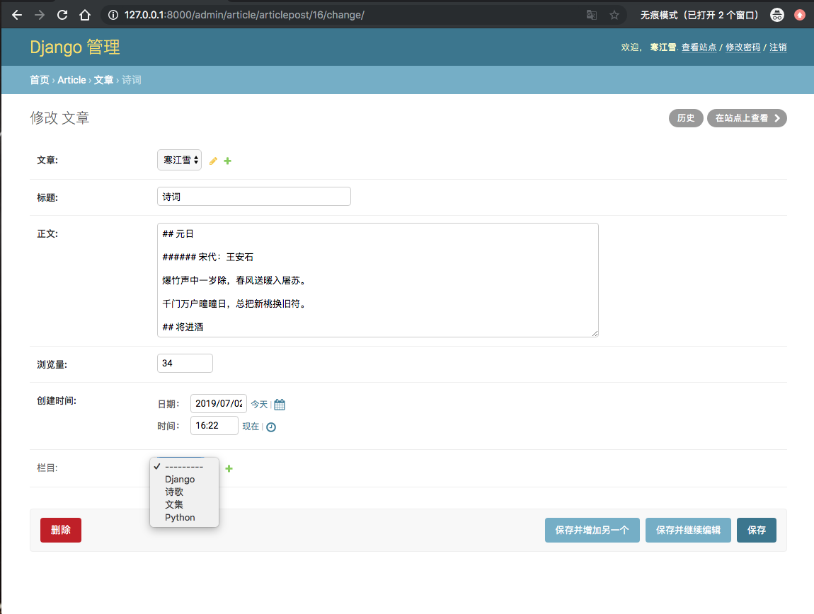

14、博客网站搭建十四

## 14.1 设置文章栏目
博客的文章类型通常不知一种，有时候你除了写一些技术文章，还会写一些诗歌，影评，或者仅仅是个记录。

因此对文章的分类就显得相当重要了，既方便博主对文章进行分类归档，也方便用户有针对性的去阅读。

## 栏目的模型
实现文章栏目功能的方法有很多种，你可以只是简单的在文章的model中增加`CharField()`字段，以字符串的形式将栏目的名称保存起来，这个实现更像是一个标签。

这样做的优点是比较简单，缺点是时间长了可能就会混淆栏目名字，也不方便对栏目的其他属性进行扩展。

因为上面我们已经说了**基于类的视图了**后面，我们写都会用基于类的视图，以前写好的，还是那句话，先造好车，在去换优质的发动机。

进入`article/models.py`：

```
# 栏目的model
class ArticleColumn(models.Model):
    # 栏目标题
    title = models.CharField(max_length=200, blank=True, verbose_name='栏目标题')
    # 创建时间
    created = models.DateTimeField(default=timezone.now, verbose_name='栏目创建时间')

    def __str__(self):
        return self.title

    class Meta:
        verbose_name = '栏目'
        verbose_name_plural = '栏目'
        
# 博客文章数据模型
class ArticlePost(models.Model):
...
...
  # 文章栏目"一对多"外键
    column = models.ForeignKey(ArticleColumn, null=True, blank=True, on_delete=models.CASCADE, 
    									related_name='article',
    									verbose_name='栏目')
...    									
```
> 记得修改Model后要迁移数据

## 列表显示栏目
模型写好之后，需要几条数据来进行测试，由于还没有写视图，所以利用Django自带后台，首先把栏目模型注册到后台：

进入`article/admin.py`：

```
from .models import ArticlePost, ArticleColumn

...

# 注册文章栏目到admin中
admin.site.register(ArticleColumn)
```
然后就可以在后台添加栏目数据了：


添加几个栏目之后，在后台打开一片文章，可以看到栏目选择：



## 重写文章列表

之前UI展示用的是卡片类型的，随着数据的增多，卡片已经不那么好用了，因此这里重写`list.html`文件：
