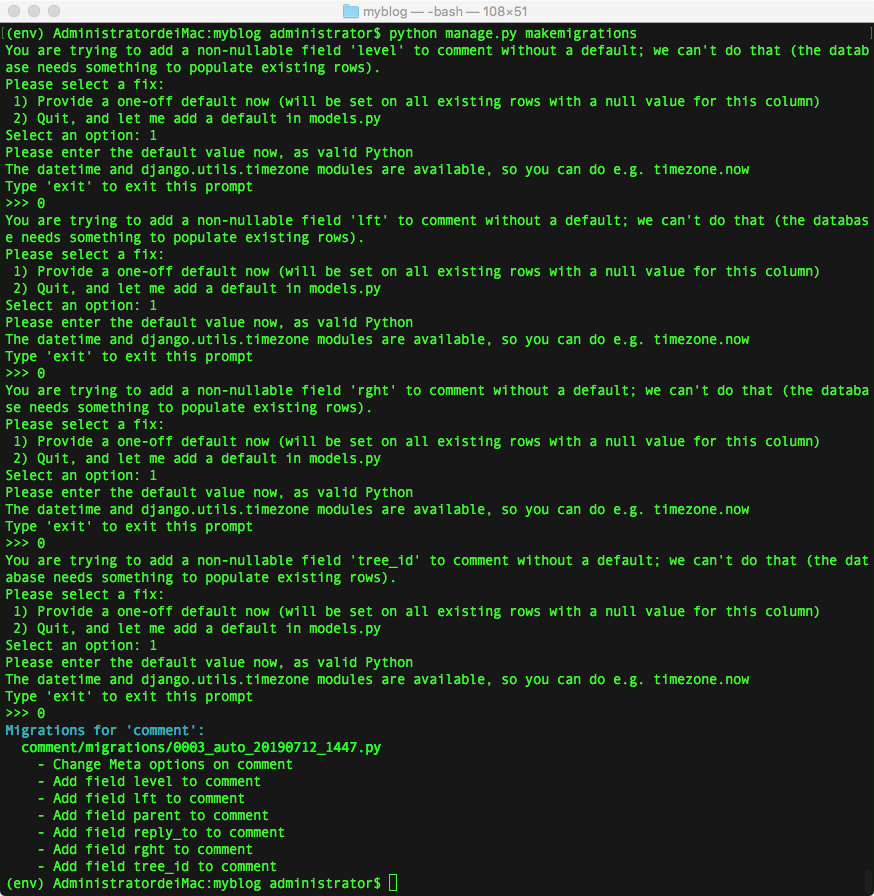

18、博客网站搭建十八

## 18.1 实现多级评论功能
多级评论意味着你需要将模型重新组织为**树形结构**。‘树根’是一级评论，而众多的‘树叶’则是次级评论。这里使用第三方库[django-mptt](https://github.com/django-mptt/django-mptt)

django-mptt模块包含了树形数据结构以及查询、修改树形数据的众多方法。任何需要树形结构的地方，都可以用 django-mptt 来搭建。比如目录。

## 重构模型
既然要建立树形结构，老的评论肯定是要修改的。首先安装`django-mptt`：

	(env) AdministratordeiMac:myblog administrator$ pip install django-mptt

安装成功后，在配置中注册：

```
INSTALLED_APPS = [
	...
    'mptt',
]
```

接下来，修改评论模型：

```
...

# 博文评论
class Comment(MPTTModel):
...
    # mptt树形结构
    parent = TreeForeignKey(
        'self',
        on_delete=models.CASCADE,
        null=True,
        blank=True,
        related_name='children'
    )

    # 记录二级评论回复给谁, str
    reply_to = models.ForeignKey(
        User,
        null=True,
        blank=True,
        on_delete=models.CASCADE,
        related_name='replyers'
    )
    
    class MPTTMeta:
        order_insertion_by = ['-created']
...        
```
> 引入`MPTT`相关模块，然后改动一下几个位置：
> 
> * 模型不能再继承自`models.Model`类，替换`MPTTModel`,因此你的模型自动拥有几个用于树形算法的新字段,（可以在数据迁移完之后在SQL工具中查看）
> * `parent`字段是必须定义的，用于存储数据之间的关系，不要去修改它。
> * `reply_to`外键用于存储评论人。
> * 将`class Meta`替换为`class MPTTMeta`,参数也有小的变化，这是模块的默认定义，实际功能是相同的。

这些改动大部分是[`django-mptt`文档的默认设置](https://django-mptt.readthedocs.io/en/latest/tutorial.html).需要说明的是这个`reply_to`.

可以考虑一下，多级评论是否允许无限级数？无限级数听起来很美好，但是套嵌层级如果过多，反而会导致结构的混乱，并且难以排版。所以这里就限制评论最多只能两级，超过两级的评论一律重置为两级，然后再将实际的被评论人存储在`reply_to`字段中。

>举例说明：一级评论人为 a，二级评论人为 b（parent 为 a），三级评论人为 c（parent 为 b）。因为我们不允许评论超过两级，因此将 c 的 parent 重置为 a，reply_to 记录为 b，这样就能正确追溯真正的被评论者了。

模型修改完了，添加了很多非空的字段进去，多以最好先清除所有的评论数据，再进行数据迁移。

迁移时出现下面的提示也不要慌，一律选第 1 项、填入数据 0 就可以了：



## 视图
前面章节已经写过一个视图`post_comment`用于处理评论了，我们将复用它：进入`comment/views.py`做一个重构:


```
from .models import Comment


# 评论文章
@login_required(login_url='/userprofile/login')
def post_comment(request, article_pk, parent_comment_id=None):
    article = get_object_or_404(ArticlePost, pk=article_pk)

    # 处理POST请求
    if request.method == 'POST':
        comment_form = CommentForm(request.POST)
        if comment_form.is_valid():
            new_comment = comment_form.save(commit=False)
            new_comment.article = article
            new_comment.user = request.user
            
            
            # 二级回复
            if parent_comment_id:
                parent_comment = Comment.objects.get(id=parent_comment_id)
                # 若回复层级超过两级，则转换为二级
                new_comment.parent_id = parent_comment.get_root().id
                # 被回复人
                new_comment.reply_to = parent_comment.user
                new_comment.save()
                return HttpResponse('200 OK')
            
            new_comment.save()
            return redirect(article)
        else:
            return HttpResponse('表单内容有误，请重新填写。')
     
    elif request.method == 'GET':
        comment_form = CommentForm()
        context = {
            'commnet_form' : comment_form,
            'article_id' : article_pk,
            'parent_comment_id': parent_comment_id
        }
        return render(request, 'comment/replay.html',context)

    # 处理错误请求
    else:
        return HttpResponse('发表评论仅接受POST请求。')

```
> * 视图参数新增了`parent_comment_id=None`.此参数代表父评论的`id`值,若为`None`则表示评论为一级评论，若有具体则为多级评论。
> * 如果视图处理的是多级评论，则用`MPTT`的`get_root()`方法将其父级重置为属性结构最底部的一级评论，然后在`reply_to`中保存实际的被回复人并保存。视图最终返回的是`HTTPResponse`字符串，后面会用到。
> * 新增处理GET请求逻辑，用于给二级回复提供空白表单，后面会用到。

现在视图中有一个`pattern_comment_id`参数用于区分多级评论，因此就要求有`url`传入参数，有的不传，就像下面的这样，进入`commment/urls.py`:

```
urlpatterns = [
    # 发表评论 处理以及回复
    path('post-comment/<int:article_pk>', views.post_comment, name='post_comment'),
    # 处理二级回复
    path('post-comment/<int:article_pk>/<int:parent_comment_id>', views.post_comment, name='comment_reply')
]
```
> 两个`path`都使用了同一个视图函数，但是传入的参数确是不一样的，第一个`path`没有`parent_commnet_id`参数，因此视图就使用了缺省值`None`,达到区分评论层级的目的。

## 前端渲染
在前端逻辑上

* 二级回复同样要使用富文本编辑器
* 回复时候不能离开当前页面
* 多个CKeditor加载时候，不嫩共有性能问题

首先要对`detail.html`的代码要重构，主要集中在显示评论部分以及相关的`JavaScript`.