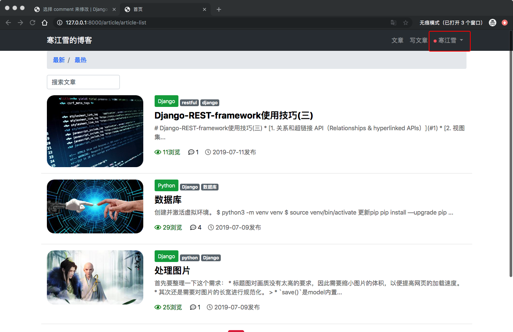
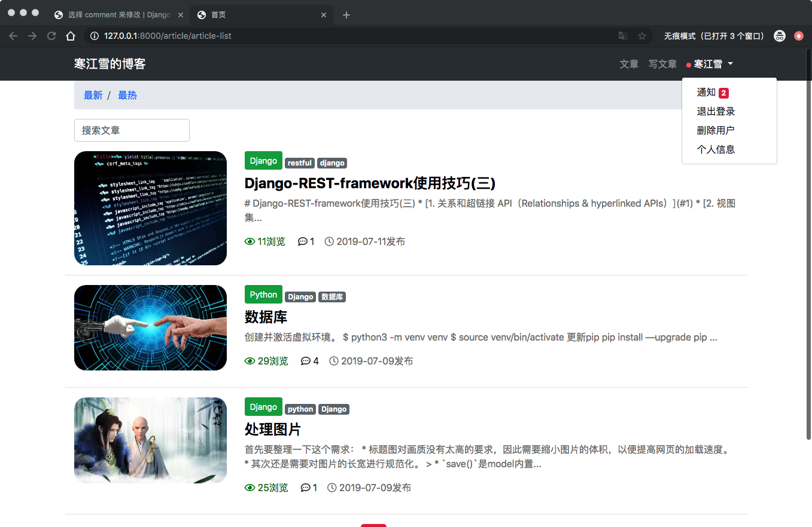

19、博客网站搭建十九(消息通知)

随着文章的增多，读者也会增多，慢慢的有些读者会对文章进行留言，读者留言肯定是要看的，而读者留言目的是想让你回复他。

怎么将读者的留言呈现给正确的用户，一个个去找也不太现实。给评论增加通知功能就是很流行的解决方案，比如朋友圈微信留言通知，以及各种社交的'小红点'.

这里我们将使用[`django-notifications`](https://github.com/guoqiao/django-notifications)为基础，非常高效的搭建一个简易的通知系统,有时间了还是要阅读一下源码。

## 发送通知
安装`django-notifications`:

	(env) AdministratordeiMac:myblog administrator$ pip install django-notifications-hq
	
注册app：

```
INSTALLED_APPS = [
...
    'notifications'
]
```

在根路由中安装路径：

```
import notifications.urls

urlpatterns = [
...
    path('inbox/notifications/', include(notifications.urls, namespace='notifications')),
]
```
> 注意这里`notifications.url`没有像之前一样字符串，是为了确保模块安装到正确的命名空间中。

数据迁移：

	(env) AdministratordeiMac:myblog administrator$ python manage.py migrate

app安装好了，接下来就是如果在项目中的任何地方发送通知了，就像这样：

```
from notifications.singles import notify

notify.send(actor, recipinter, verb, target, action_object)
```
其中的参数释义：

* `actor`:发送通知的对象
* `recipient`：接受通知的对象
* `verb`: 动词短语
* `target`：链接到动作的对象（可选）
* `action_object`: 执行通知的对象（可选）

举个栗子：**寒江雪**(`action`)在**个人博客**（`target`）中对**你**（`recipient`）**发表了**(`verb`)**评论**(`action_object`).

因为我们想要在用户评论的时候发送通知，因此修改一下发表评论的视图，进入视图`comment/views.py`：

```
from notifications.signals import notify
from django.contrib.auth.models import User

...
def post_comment(...):
    ...

    # 已有代码，创建新回复
    if comment_form.is_valid():
        ...

        # 已有代码，二级回复
        if parent_comment_id:
            ...

            # 新增代码，给其他用户发送通知
            if not parent_comment.user.is_superuser:
                notify.send(
                    request.user,
                    recipient=parent_comment.user,
                    verb='回复了你',
                    target=article,
                    action_object=new_comment,
                )

            return HttpResponse('200 OK')

        new_comment.save()

        # 新增代码，给管理员发送通知
        if not request.user.is_superuser:
            notify.send(
                    request.user,
                    recipient=User.objects.filter(is_superuser=1),
                    verb='回复了你',
                    target=article,
                    action_object=new_comment,
                )

        return redirect(article)
...
```
> 增加了两条`notify`语句，分别位于两个if语句中：
> 
> * 第一个`notify`：用户之间可以相互评论，因此需要发送通知。if语句也是为了防止管理员收到重复的通知。
> * 第二个`notify`:所有的评论都会给管理员(也就是博主)发送通知，除了管理员自己。

>其他的代码没有变化，注意位置不要错就行了。你可以试着发送几条评论，然后打开SQLiteStudio，查看notifications_notification表中的数据变化。

## 小红点
后台创建通知的逻辑已经写好了，如上如果不能在前端显示出来，那也没起到什么作用。

而前端显示消息通知比较流行的就是“小红点”。流行的都已经泛滥了，进入很多软件其实根本都不需要。另一种形式的消息就是徽章，即 一个红色方框中带有消息条目的计数。这两种方式都会用到博客页面中。

在位置的选择上，`header`是很合适的，因为它在博客位置都会显示，很符合通知本身的定位。因此修改`templates/header.html`：

```
<!-- 引入notifications的模板标签 -->



...

<!-- 已有代码，用户下拉框 -->
<li class="nav-item dropdown">
    <a class="nav-link dropdown-toggle" ...>

        <!-- 新增代码，小红点 -->
        
            <svg viewBox="0 0 8 8"
                 width="8px"
                 height="8px">
                <circle cx="4"
                        cy="4"
                        r="4"
                        fill="#ff6b6b"
                        ></circle>
            </svg>
        

        {{ user.username }}
    </a>
    <!-- 已有代码，下拉框中的链接 -->
    <div class="dropdown-menu" ...>

        <!-- 新增代码，通知计数 -->
        <a class="dropdown-item" href="#">通知
            
            <span class="badge badge-danger">{{ unread_count }}</span>
            
        </a>

        ...
        <a ...>退出登录</a>
    </div>
</li>

...
```
> `django-notifications`自带建议模板标签，可以在前台模板中调用重要的通知相关的对象，在顶部引入就可以了。比如使用`unread_count`是当前用户的未读通知的计数。
> 
> `Bootstrap`自带徽章的样式，但是却没有小红点的样式，所以只能用`svg`自己画了一个，好在也不难。
> >`svg`是绘制矢量图形的标签，可以在[菜鸟教程](https://www.runoob.com/svg/svg-inhtml.html)查看。


然后登陆另外一个账号，评论另一个账号的文章，会看到如下如所示：



可以看到效果了，但是`href`是空的，接下来就处理。

## 未读与已读

既然知道了通知，那么肯定能分成未读的和已读的两种。在适当的时候，未读通知又需要转换为已读。现在集中处理这些功能。

通知是一个独立的功能，以后可能在任何地方用到，放到评论APP中并不合适。

所以新建一个APP：

	(env) AdministratordeiMac:myblog administrator$ python manage.py startapp notice

注册：

```
INSTALLED_APPS = [
...
    'notice',
]
```

跟路由：

```
urlpatterns = [
...
    # notice
    path('notice/', include('notice.urls', namespace='notice')),
]
```

```
...
urlpatterns = [
    ...
    # notice
    path('notice/', include('notice.urls', namespace='notice')),
]
...
```
接下来就是试图了，之前所有的视图都是用的视图函数，这次我们更近一步，用类视图来完成。进入`notice/views.py`:

```
from django.shortcuts import redirect
from django.views import View
from django.views.generic import ListView
from django.contrib.auth.mixins import LoginRequiredMixin
from article.models import ArticlePost


class CommentNoticeListView(LoginRequiredMixin,ListView)：
    """通知列表"""
    # 上下文的名称
    context_object_name = 'notices'
    # 模板位置
    template_name = 'notice/list.html'
    # 登录重定向
    login_url = '/userprofile/login/'
    
    
    # 未读通知查询集
    def get_queryset(self):
        return self.request.user.notifications.unread()
    

class CommentNoticeUpdateView(View):
    """更新通知状态"""
    # 处理 get 请求
    def get(self, request):
        # 获取未读消息
        notice_id = request.GET.get('notice_id')
        # 更新单条通知
        if notice_id:
            article = ArticlePost.objects.get(id=request.GET.get('article_id'))
            request.user.notifications.get(id=notice_id).mark_as_read()
            return redirect(article)
        
        # 更新全部通知
        else:
            request.user.notifications.mark_all_as_read()
            return redirect('notice:list')
    

```

> 视图共两个：
> 
> * `CommentNoticeListView`：继承`ListView`,用于展示所有的未读通知。`get_queryset`方法返回了传递给模板的上下文对象。`unread()`