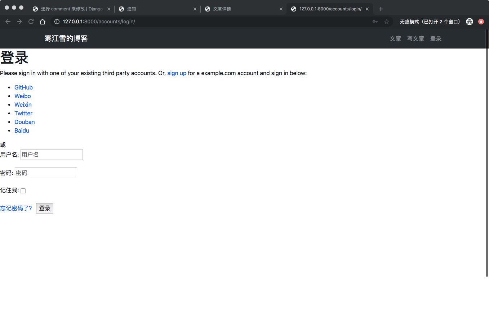
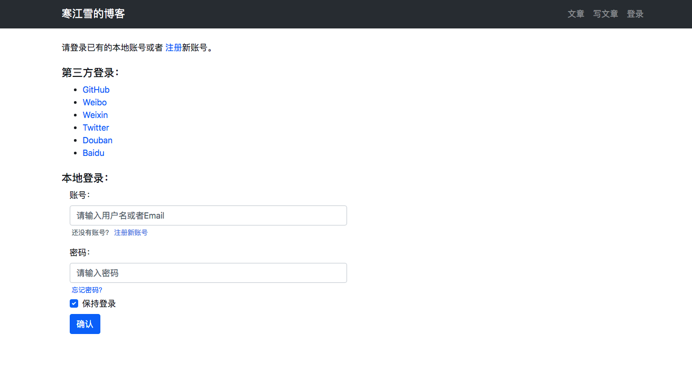

21、博客网站搭建二十一(三方登录)

有些用户不会愿意一个网站注册一个账号的，也记不住，比较流行的方案是允许用户进行第三方登录，既可以通过GitHub、微博这类知名的社区进行授权，从而登录你的小站，免去了注册的麻烦。

这里介绍一个主流的库:`Django-allauth`,他不仅包含一整套的本地注册、登录、管理的解决方案，还支持GitHub、Twitter、微博、微信甚至百度等几十种三方登录方式。

## 登录
先看看`django-allauth`的本地登录如何配置。安装`django-allauth`:

	(env) AdministratordeiMac:myblog administrator$ pip install django-allauth

修改配置文件：进入`mysite/setting.py`修改配置：

```
...


TEMPLATES = [
    {
        ...
        'OPTIONS': {
            'context_processors': [
                # allauth 启动必须项
                'django.template.context_processors.request',
            ],
        },
    },
]


AUTHENTICATION_BACKENDS = (
    # Django 后台可独立于 allauth 登录
    'django.contrib.auth.backends.ModelBackend',

    # 配置 allauth 独有的认证方法，如 email 登录
    'allauth.account.auth_backends.AuthenticationBackend',
)


INSTALLED_APPS = [
    ...
    # allauth 启动必须项
    'django.contrib.auth',
    'django.contrib.messages',
    'django.contrib.sites',

    'allauth',
    'allauth.account',
    'allauth.socialaccount',

    # 可添加需要的第三方登录
    'allauth.socialaccount.providers.github',
    'allauth.socialaccount.providers.weibo',
    'allauth.socialaccount.providers.weixin',
    'allauth.socialaccount.providers.twitter',
    'allauth.socialaccount.providers.douban',
    'allauth.socialaccount.providers.baidu',
    ...
]

# 设置站点
SITE_ID = 1

# 登录成功后重定向地址
LOGIN_REDIRECT_URL = '/article/article-list'

...
```
> 注意上面的配置中，有的内容是创建项目是本身就有的，检查一下项目中包含的，添加一些没有包含的，不要遗漏。

`django-allauth`是一个app，因此也需要分给它一个URL，进入`mysite/urls.py`：

```
urlpatterns = [
    ...
    path('accounts/', include('allauth.urls')),
    ...
]
```
最后一步，迁移数据：

	(env) AdministratordeiMac:myblog administrator$ python manage.py migrate

输入在`django-allauth`的默认登录页面地址：

	http://127.0.0.1:8000/accounts/login/



## 设置网站首页
博客网站的首页通常就是文章列表本身，因此把这个路由添加到`mysite/urls.py`:

```
...
from article.views import article_list

urlpatterns = [
    # home
    path('', article_list, name='home'),
    ...
]
...
```
再把登录成功后重定向地址改过来,进入`mysite/setting.py`：

```
...
# 重定向 url
#LOGIN_REDIRECT_URL = '/article/article-list'
LOGIN_REDIRECT_URL = '/'
```
这样就拥有的了地址为`http://127.0.0.1:8000`首页了。

## 美化模板

`django-allauth`自带的模板简直不忍直视，要覆盖为自己网站的风格才能使用。
还记得我们的虚拟环境吗，没错，所有项目运行所有需要的三方库都是保存在这个虚拟环境的文件夹中的，在本教程中也就是`env`文件夹，找到下面的路径。

	env/lib/python3.7/site-packages/allauth/templates/account/login.html

这个`login.html`就是原始的登录模板文件了，虽然可以直接修改这个文件来优化页面，但是这样做是不太友好的呢，因为当你升级库的时候，或者换台电脑部署的时候，模板又恢复回去了呢。

正确的做法是复制这个`login.html`到你自己项目中的`templates`文件夹中去。即你需要在项目创建一个完全相同的路径：

	templates/account/login.html
> Django会优先在项目中寻找模板文件，因此只要相对路径相同，则可以达到覆写的目的。

接下来就可以愉快的定制风格了，参考代码如下,进入tempaltes,新建文件夹account/login.html，写入如下代码：

```





登录




<div class="container">
    <div class="row">
        <div class="col-12">
            <br>
            
            
             <p>
                请登录已有的本地账号或者
                    <a href="{{ signup_url }}">注册</a>新账号。
                
             </p>

             <div class="socialaccount_ballot">
                <h5 class="mb-2 mt-4">第三方登录：</h5>
                <ul class="socialaccount_providers">
                    
                </ul>
                <h5 class="mb-2 mt-4">本地登录：</h5>
             </div>
            

            
             <p> If you have not created an account yet ,then please
                 <a href="{{ signup_url }}">sign up</a>first.
             </p>
            

            <div class="col-6">
                <form class="login" id="login_form" method="post" action="">
                    
                    <div class="form-group">
                        <label for="id_login">账号：</label>
                        <input type="text" name="login" placeholder="请输入用户名或者Email" autofocus="autofocus"
                        required id="id_login" class="form-control">
                        <small class="form-text text-muted ml-1">
                            还没有账号？
                            <a href="" style="color: cornflowerblue;">注册新账号</a>
                        </small>
                    </div>

                    <div class="form-group mb-1">
                        <label for="id_password">密码：</label>
                        <input type="password" name="password" placeholder="请输入密码" required id="id_password"
                        class="form-control">
                        <small class="form-text text-muted ml-1">
                            <a class="secondaryAction layui-text" href="">忘记密码？</a>
                        </small>
                    </div>

                    <div class="custom-control custom-checkbox mb-2">
                        <input type="checkbox" name="remember" id="id_remember" checked class="custom-control-input">
                        <label for="id_remember" class="custom-control-label">保持登录</label>
                    </div>

                    <button class="primaryAction btn btn-primary" type="submit" hidden id="submit_login"> 确认</button>
                    <button class="primaryAction btn-primary btn" type="button" id="on_submit_login">确认</button>

                </form>

            </div>
        </div>
    </div>
</div>


```

刷新页面如下：



除了登录页面以外，其他的所有页面，如注册、邮箱认证页面及邮件、第三方登录页面等都可以用这种方法进行覆写。教程中就不再赘述，读者请自行尝试。