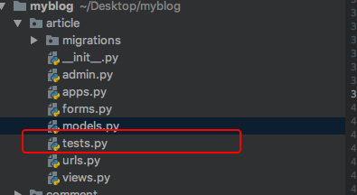

# 22、博客网站搭建二十二(自动化测试)

测试是伴随着开发进行的，开发多久，测试多久，我们一路开发过来都是怎么直接测试，启动服务`runserver`，看看写的页面是够正常。

这样的人工测试有点是非常直观的，你看到的和用户看到的完全是相同的，但是确定也是很明显的：

* 效率低。在开发的时候你可能需要反复修改代码，测试功能，这样重复查看几十次甚至几百次网页会让人崩溃的。
* 容易遗漏BUG。伴随你项目越来越复杂，组件之间的交互更加复杂。修改某一组件的时候，可能会影响到其他地方，有些你是暂时发现不了的，有些影响范围比较广，你只是测试当前修改的部分，所以会遗漏。
* 有的测试不方便进行。如果有的功能，限制每个用户每天发表评论不能超过10条评论，人工测试就显得比较麻烦，特别是需要反复测试的时候。

为了解决人工测试的各种问题，`Django`引入了`Python`标准库的单元测试。也就是自动化测试：你可以写一段代码，让代码帮你测试！代码会忠实完成测试任务，帮助你从繁重的测试工作中解脱出来。除此之外，自动测试化还有以下优点：

* 预防错误。当应用过于复杂的时候，代码的意图变得非常不清晰，甚至你都看不懂自己写的代码，这是很常见的，而测试好像就是从内部审查代码一样，可以帮助你发现微小错误。
* 有利于团队合作。 良好的测试保证其他人不会不小心破坏你的代码，现在已经不是单打独斗的年代了，想要成为优秀的程序员，你必须擅长写测试代码。

虽然学习自动化不会让你的博客网站增加一丝功能，但是可以让你代码更加强壮。

[Django官网文档的第5部分](https://docs.djangoproject.com/zh-hans/2.2/intro/tutorial05/)讲的非常清晰，并且有中文版，推荐直接去读官网。

## 第一个测试
为了演示测试是如何工作的，让我们首先在文章模型中写个有BUG的方法，进入`article/models.py`:

```
class ArticlePost(models.Model):
    ...

    def was_created_recently(self):
        # 若文章是"最近"发表的，则返回 True
        diff = timezone.now() - self.created
        if diff.days <= 0 and diff.seconds < 60:
            return True
        else:
            return False
```
> 这个方法用于检测当前文章是否最近发表的。
> 
> 这个方法稍微扩展一下会变的非常实用。比如可以将博文的发表日期改为'刚刚'，‘3分钟前’，‘1小时前’等相对应的时间，用户体检将有提升。

仔细看看，它是没有办法正确判断‘未来’，输入`python manage.py shell`文章的进入shell：

```
>>> import datetime
>>> from django.utils import timezone
>>> from article.models import ArticlePost
>>> from django.contrib.auth.models import User

# 创建一篇"未来"的文章
>>> future_article = ArticlePost(author=User(username='user'), title='test',body='test', created=timezone.now() + datetime.timedelta(days=30))

# 是否是“最近”发表的？
>>> future_article.was_created_recently()
True
```
未来发生的肯定不是最近发生的，因此代码是错误的。

## 写个测试暴露BUG
接下来就要写测试用例，将测试转化为自动化。

如下图的目录：



其中这个`test.py`就是留给你写测试用例的地方，进入`articel/tests.py`:

```
from django.test import TestCase
import datetime
from django.utils import timezone
from article.models import ArticlePost
from django.contrib.auth.models import User


class ArticlePostModelTests(TestCase):
    def test_was_created_recently_with_future_articel(self):
        # 如果文章创建时间为未来，则返回FALSE
        author = User(username='user', password='test_password')
        author.save()

        future_article = ArticlePost(
            author=author,
            title='test',
            body='test',
            created_time=timezone.now() + datetime.timedelta(days=30)
        )

        self.assertIs(future_article.was_created_recently(),False)

```

> 基本就是把刚才在`shell`中的测试代码抄了过来，有点不同的是这个`asserIs`方法，了解**断言**的同学应该很熟悉它：它的作用就是检测方法内的两个参数是否完全一致，如果不是则抛出异常，提醒你这个地方是有问题的。

接下来运行测试：

	(env) AdministratordeiMac:myblog administrator$ python manage.py test
	
运行结果如下：

```
Creating test database for alias 'default'...
System check identified no issues (0 silenced).
F
======================================================================
FAIL: test_was_created_recently_with_future_articel (article.tests.ArticlePostModelTests)
----------------------------------------------------------------------
Traceback (most recent call last):
  File "/Users/administrator/Desktop/myblog/article/tests.py", line 21, in test_was_created_recently_with_future_articel
    self.assertIs(future_article.was_created_recently(),False)
AssertionError: True is not False

----------------------------------------------------------------------
Ran 1 test in 0.002s

FAILED (failures=1)
Destroying test database for alias 'default'...
```
> 这里是有很多名堂的：
> 
> * 首先测试系统会在所有以test开头的文件中寻找测试代码
> * 所有`TestCase`的子类都被认为是测试代码
> * 系统创建了一个特殊的数据库功测试使用，即所有测试产生的数据不会对你自己的数据库造成影响
> * 类中所有以`test`开头的方法都会被认为是测试用例
> * 在运行测试用例的时候，`assertIs`抛出异常，因为`True is not False`
> * 完成测试后，自动销毁测试数据库

测试系统明确指明了错误的数量、位置和种类等信息。

## 修正BUG
既然通过测试找到了BUG，那么接下来就要把代码进行修正，进入`article/models.py`:

```
from django.utils import timezone

class ArticlePost(models.Model):
    ...

    def was_created_recently(self):
        diff = timezone.now() - self.created

        # if diff.days <= 0 and diff.seconds < 60:
        if diff.days == 0 and diff.seconds >= 0 and diff.seconds < 60:
            return True
        else:
            return False
```
重新测试结果如下：

```
(env) AdministratordeiMac:myblog administrator$ python manage.py test
Creating test database for alias 'default'...
System check identified no issues (0 silenced).
.
----------------------------------------------------------------------
Ran 1 test in 0.002s

OK
Destroying test database for alias 'default'...
```

这次代码顺利通过测试。

可以完全肯定的是，在往后的开发中，这个BUG不会再出现，因为一旦你运行一遍测试，就会立即收到警告。可以认为这个项目的一小部分代码永远是安全的呢。

## 更全面的测试
既然一个测试用例既可以保证一小段代码的永远安全，那我写一堆测试岂不是可以保证整个项目的永远安全吗？的确如此，这个买卖绝对不亏的。

因此我们继续增加几个测试，全面强化代码，进入`article/tests.py`:

```
from django.test import TestCase
import datetime
from django.utils import timezone
from article.models import ArticlePost
from django.contrib.auth.models import User
from django.urls import reverse
from time import sleep


class ArticlePostModelTests(TestCase):
    def test_was_created_recently_with_future_articel(self):
        # 如果文章创建时间为未来，则返回FALSE
        author = User(username='user', password='test_password')
        author.save()

        future_article = ArticlePost(
            author=author,
            title='test',
            body='test',
            created_time=timezone.now() + datetime.timedelta(days=30)
        )

        self.assertIs(future_article.was_created_recently(), False)

    def test_was_created_recently_with_seconds_before_article(self):
        # 若文章创建时间为1分钟内，则返回TRUR
        author = User(username='user1',password='test_password')
        author.save()
        seconds_before_article = ArticlePost(
            author=author,
            title='test1',
            body='test1',
            created_time=timezone.now() - datetime.timedelta(seconds=45)
        )

        self.assertIs(seconds_before_article.was_created_recently(), True)

    def test_was_created_recently_with_hours_before_article(self):
        # 如果文章创建为几个小时前，则返回FALSE
        author = User(username='test2', password='twst_password')
        author.save()
        hours_before_article = ArticlePost(
            author=author,
            title='test2',
            body ='test2',
            created_time=timezone.now() - datetime.timedelta(hours=3)
        )

        self.assertIs(hours_before_article.was_created_recently(), False)

    def test_was_created_recently_with_days_before_article(self):
        # 如果文章创建为几个小时前，返回FALSE'
        author = User(username='user2', password='test_password')
        author.save()
        months_before_article = ArticlePost(
            author=author,
            title='test3',
            body='test3',
            created_time=timezone.now() - datetime.timedelta(days=5)
        )
        self.assertIs(months_before_article.was_created_recently(), False)
```
> 现在我们要拥有4个测试，来保证`was_created_recently()`方法来对于过去，最近、未来中的4个情况都返回了正确的值，你可以继续扩展、知道你觉得完全没有任何隐藏BUg的可能为止。
> 
> 在实际的开发中，有些难缠的BUG会把自己伪装的非常好，而不是想教程中写的那么明确知道他在哪里，有了自动话测试之后，无论以后你的项目怎么变复杂，，只要在测试中写好你的逻辑就一定是符合预期的，而你所需要做的以为运行一条测试指令而已。
> 
> 虽然这里只是使用了`assertIs`,但是实际上Django中的断言有大概几十种多，比如`assertEqual`,`assertContains`等，并且还在不断更新，详见[python标准断言](https://docs.python.org/3/library/unittest.html#unittest.TestCase)和[Django扩展断言](https://docs.djangoproject.com/zh-hans/2.2/topics/testing/tools/#assertions)。


## 测试视图
上面的测试都是针对模型的。视图该怎么测试？如何通过测试系统模拟用户的请求呢？

`TestCase`类提供了一个供测试使用的Client来模拟用户通过请求和视图层代码交互。

以文章详情的浏览统计为例，比较容易出现潜在BUG有：

* 增加浏览量为证正常保存进数据库（即每次请求浏览量+1）
* 增加浏览量的同时，`update`字段也错误的一并更新

所以针对这些2条测试，新写一个专门的测试视图的类，与前面的测试模型的类区分开，进入`articel/tests.py`:

```
...
from time import sleep
from django.urls import reverse

...
class ArticlePostViewTests(TestCase):

    def test_increase_veiws(self):
        # 请求详情视图是偶，阅读量+1
        author = User(username='user4',password='test_password')
        author.save()
        article = ArticlePost(
            author=author,
            title='test4',
            body='test4',
        )
        article.save()
        self.assertIs(article.total_views, 0)

        url = reverse('article:article_detail', args=(article.pk,))
        response = self.client.get(url)

        viewed_article = ArticlePost.objects.get(pk=article.pk)
        self.assertIs(viewed_article.total_views,1)

    def test_increase_views_but_changge_update_field(self):
         # 请求详情视图时候，不改变update 字段
         author = User(username='user5', password='test_password')

         author.save()
         article = ArticlePost(
             author=author,
             title='test5',
             body='test5',
         )
         article.save()

         sleep(0.5)
         url = reverse('article:article_detail', args=(article.pk,))
         response = self.client.get(url)

         viewed_article  =ArticlePost.objects.get(pk=article.pk)
         self.assertIs(viewed_article.update_time - viewed_article.created_time < timezone.timedelta(seconds=0.1), True)

         
```
> 注意看代码是如何与视图层交互的:`response = self.client.get(url)`向视图发起请求并获得响应，省下来就是从数据库中取出更新后的数据，并用断言语句来判断代码是否符合预期了。

运行测试：

```
(env) AdministratordeiMac:myblog administrator$ python manage.py test
Creating test database for alias 'default'...
System check identified no issues (0 silenced).
......
----------------------------------------------------------------------
Ran 6 tests in 0.662s

OK
Destroying test database for alias 'default'...
```
6条测试用例全部通过。

## 测试越多越好

仅仅是app中的两个非常小的功，就已经写了6条测试用例了，并且还可以继续扩展。除此之外，其他的每个模型、视图都可以扩展出几十甚至上百条测试，这样下去代码量很快就失去控制了，并且对于相对专业的业务代码来说，测试代码会显得繁盛且不够优雅。

但是没干系。就让测试代码肆意增长吧，大部分情况下，你写完一个测试之后就可以忘掉它了，在你继续开发的过程中，它会一直默默无闻的为你做贡献。最坏的情况就是当你继续开发的时候，发现之前的一些测试看起来是多余的，但是现在也不是问题，多做些测试也不错，后面做到一定程度再想着优化分离吧。

## 深入代码测试

在前面的测试中，我们已经从模型层和视图层的角度检查应用的输入输出，但是模板呢，虽然可以用`assertInHTML`、`assertJSONEqual`等断言大致检查模板中的某些内容，但是更加近似于浏览器的检查就要使用`Selenium`等测试工具（毕竟Django的重点是后端不是前端）。

`Selenium`不仅可以测试Django框架的代码，甚至可以检查JavaScript代码，他假装成一个正在和你站点进行交互的浏览器，就好像有个人访问网站一样。Django提供了`LiveServerTestCase`来和`Selenium`这样的工具进行交互。

关乎测试的话题这里只是开了一个头，可以继续阅读下面的内容进一步去来了解：

* [Django:Writing and runing tests](https://docs.djangoproject.com/en/2.2/topics/testing/overview/)
* [Django: Testing tools](https://docs.djangoproject.com/en/2.2/topics/testing/tools/)
* [Django: Advanced testing topics](https://docs.djangoproject.com/en/2.2/topics/testing/advanced/)
* [Selenium官方文档](https://selenium-python.readthedocs.io/getting-started.html)

