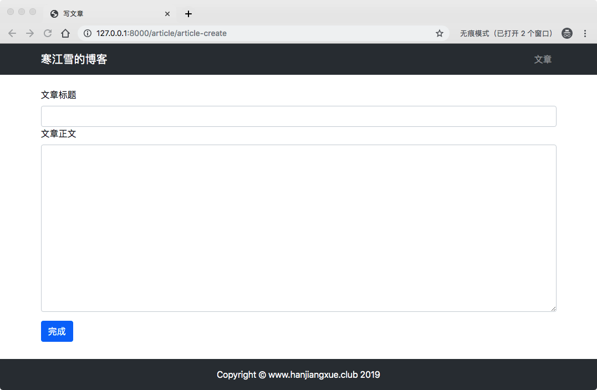
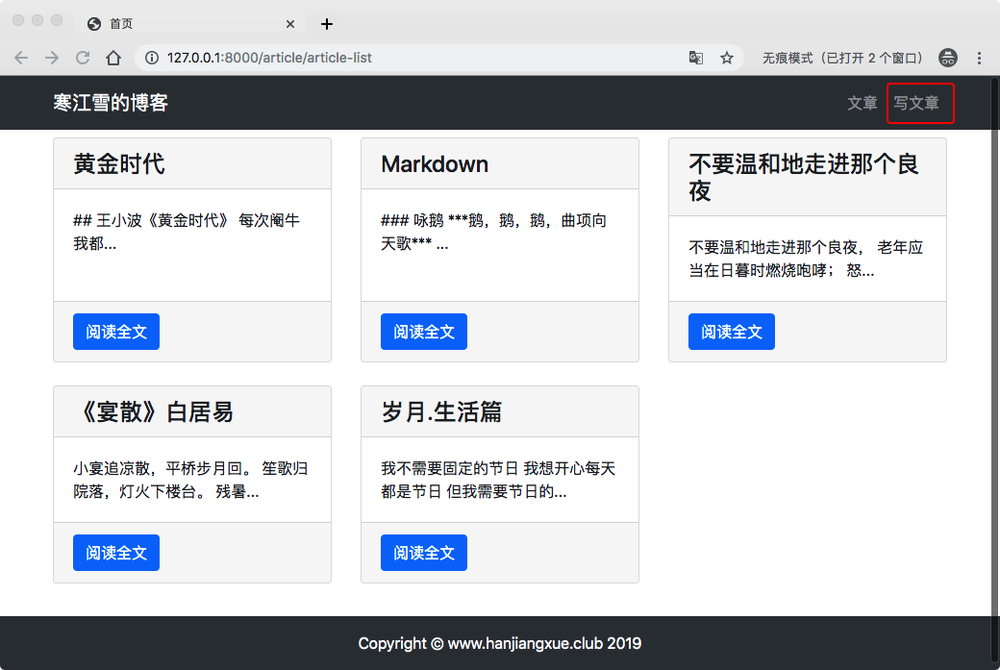
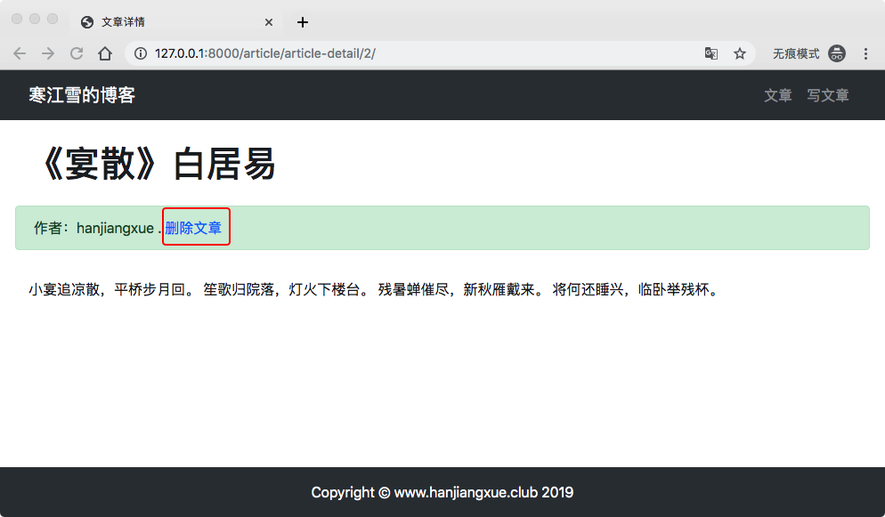
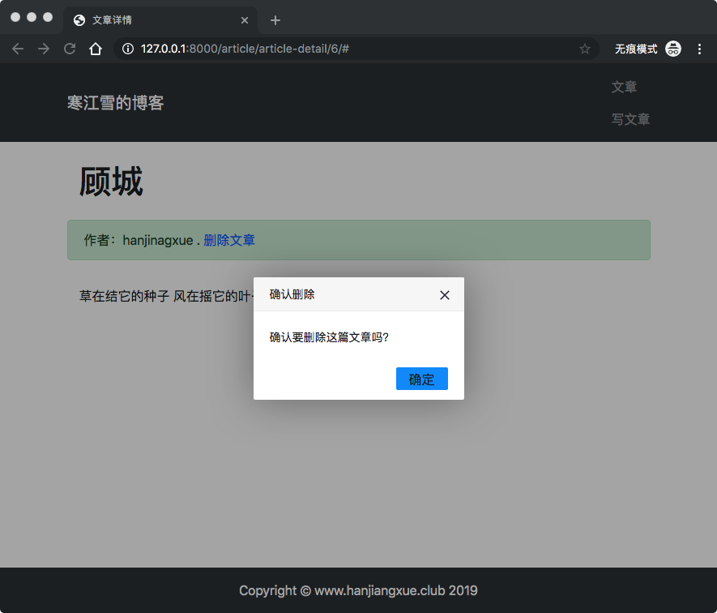
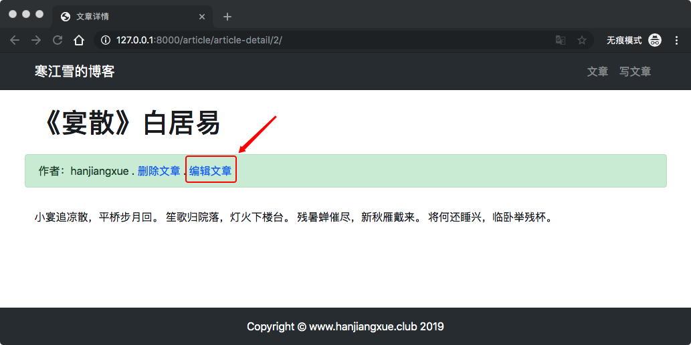

# 6、博客网站搭建六(发表新文章，删除文章，编辑文章)

## 6.1 添加发表新文章功能

前面我们已经搞定了Markdown，但是发表新文章，每次都去后台视乎有点太麻烦了，作为一个开发人员，这是无法忍受的呢，所以我们要在前台满足后台的一些功能。

## Forms表单类
在HTML中，表单`<form>..</form>`中的一些元素，它允许访客做类似输入文本，选项、操作对象或空间等动作，然后发送这些信息到服务端。一些表单界面元素（文本框或者复选框）非常简单并内置在HTML中，而其他复杂些的，像日期选择等操作控件。

处理表单是一件复杂的事情，看一下Django的admin，许多不同类型的数据可能需要自一张表中准备显示，渲染成HTML，使用方便的界面进行编辑，传到服务器，验证和清理数据。然后保存或者进行下一步处理。

Django的表单功能大致可以简化大部分内容，并且比大多数人自己写的安全的多。

Django表单系统的核心组件是`form`类，他能够描述一张表单并决定它如何工作及呈现。

使用form类也很简单，需要在`article`文件夹下卖弄创建`froms.py`文件，写入一下代码：

```
# 引入表单类
from django import forms
# 引入文章模型
from .models import ArticlePost


# 写文章的表单类

class ArticlePostForm(forms.ModelForm):
    
    class Meta:
        # 指明数据模型的来源
        model = ArticlePost
        # 定义表单包含的字段
        fields = ('title', 'body')

```
> 代码中`ArticlePostForm`类继承了Django的额表单类`Form.ModelForm`,并在类中定义了内部类`class Meta`,指明了数据模型的来源，以及表单中应该包含的数据模型的那些字段。
> 
> 在`ArticlePost`模型中，`created_time`和`update_time`都是自动生成，不需要填入，`author`字段暂时固定为id=1的管理员用户，也不用填，剩下的就是`title`和`body`就是表单需要填入的内容了。

接下来改写`article/views.py`，添加一个视图函数处理写文章的请求：

```

# 引入redirect重定向的模块
from django.shortcuts import render, redirect
from .models import ArticlePost
import markdown
from django.http import HttpResponse
# 引入定义的from表单类
from .forms import ArticlePostForm
# 引入User模型
from django.contrib.auth.models import User

...
...

# 写文章的视图
def article_create(request):
    # 判断用户是否提交数据
    if request.method == 'POST':
        # 将提交的数据赋值到表单实例中
        article_post_form = ArticlePostForm(data=request.POST)
        # 判断提交的数据是否满足模型的要求
        if article_post_form.is_valid():
            # 保存数据，但暂时不提交到数据库中
            new_article = article_post_form.save(commit=False)

            # 指定数据库中id=1的用户作为作者
            # 如果你进行过删除数据表的操作，可能会找不到id=1的用户
            # 此时请重新创建用户，并出入此用户的id
            new_article.author = User.objects.get(id=1)
            # 将文章保存到数据库中
            new_article.save()

            # 完成后返回文章列表
            return redirect('article:article_list')
        else:
            return HttpResponse('内容填写有误，请重新填写啦。')
    # 如果用户请求获取数据
    else:
        # 创建表单类实例
        article_post_form = ArticlePostForm()
        # 赋值上下文
        context = {'article_post_form': article_post_form}
        # 返回模板
        return render(request, 'article/create.html', context)
    
```
> 上面的代码，但是试图接收到一个客户端的`request`请求的手，首先根据`request.method`判断用户要提交的数据（POST），还是获取数据（GET）:
> 
> * 如果用户提交数据，将POST给服务器的表单数据赋予`article_post_form`实例，然后使用Django内置的方法`.is_valid()`判断提交的数据是否满足模型的要求。
> * 如果满足需求，保存表单中的数据(`commit=False`暂时保存不提交数据库，因为`author`还未指定)，并指定`author`为id=1的管理员用户。然后提交到数据库，并通过`redirect`返回文章列表。`redirect`可以通过url的地址名字，反向解析到对应的url。
> * 如果满足，则返回一个字符串”填写错误，重新填写“，告诉用户出现了什么问题。
> * 如果用户是获取数据，则返回一个空的表单类对象，提供给用户填写。

Django官方文档对Form类有做详细的说明：

`Form`实例可以绑定到数据，也可以不绑定数据。

* 如果绑定到数据，就能够验证数据并将表单呈现为HTML并显示数据
* 如果未绑定，则无法进行验证（因为没有要验证的数据），但是仍然可以将空白表单呈现为HTML

要将数据绑定到表单，将数据作为字典，作为第一个参数传递给`Form`类构造函数：

关于`Form`类的详细说明可以查看[Form API](https://docs.djangoproject.com/zh-hans/2.1/ref/forms/api/)

写好视图之后，我们可以写模板文件了。在`templates/article/`文件下新建`create.html`。

```
# templates/article/create.html





写文章




{#写文章表单    #}
<div class="container">
    <div class="row">
        <div class="col-12">
            <br>
{#            提交文章的表单#}
            <form method="POST" action="">
{#                Django中需要POST数据的笛梵个必须有csrf_token#}
                
                <div>
{#                标签#}
                    <label for="title">文章标题</label>
{#                文本框#}
                     <input type="text" class="form-control" id="title" name="title">
                </div>
{#                文章正文#}
                <div class="form-group">
                    <label for="body">文章正文</label>
{#                    文本区域#}
                    <textarea type="text" class="form-control" id="body" name="body" rows="12"></textarea>
                </div>
{#                提交按钮#}
                <button type="submit" class="btn btn-primary">完成</button>
            </form>
        </div>
    </div>
</div>

```
>* `<form>..</form>`标签中的内容就是要提交的表单。`methods='post'`指定了表单提交方式为`POST`(与视图中的`request.methods`像对应)；`action="`指定了表单提交的地址的url。
>* 关于``,它是Django中一个与网络安全相关的中间件验证，目前先不去深究，**只要记得表单中必须包含它就可以了，否则会有一个403的错误**。
>* `<input>`和`<textarea>`标签中的`name=''`属性，指定了当前文本框提交的数据名称，它必须与表单类中的字段名称对应，否则服务器无法将字段和数据正确对接起来。

写好了这写，在`article/urls.py`中增加一个写文章的url地址链接：

```
# article/urls.py

urlpatterns = [
	...
   ...
    # 写文章
    path('article-create', views.article_create, name='article_create'),
]
```
老规矩,如果你没搬错转，启动服务，在浏览器输入`http://127.0.0.1:8000/article/article-create`,***得到如下：***



然后你可以写入标题，内容点击完成会跳转到文章列表页，就会看到你添加的文章了。


## 优化写文章入口
前面我们已经有过类似的经验了，就是在导航那里点击文章会回到文章列表页，这里也是同样的道理，我们在`hearder.html`添加一下代码：

```
# templates/header.html
...
  	<li class="nav-item">
         <a class="nav-link" href="">写文章</a>
    </li>
...
```
刷新浏览器看到一下页面：


点击写文章按钮就可以直接进入添加文章的页面了呢。

## 6.2 添加删除文章功能
照着葫芦画葫芦，上面已经有添加文章了，这里删除文章功能就是毛毛雨了呢。

首先进入`article/views.py`，增加视图函数：

```
...
...
# 删除文章
def article_delete(request, pk):
    # 根据对应的id去删除对应的文章
    article = ArticlePost.objects.get(pk=pk)
    # 调用。delete()方法
    article.delete()
    return redirect('article:article_list')
```
> * 与查询文章类似，删除文章必须有固定的id，才能删除对应的文章
> * 接着调用`.delete()`方法删除数据库中这篇文章的条目
> * 删除成功后返回文章列表

这里删除先不做用户限制，任何人都可以删除，后面学到了用户管理的只是之后，再回过来修改这些东西。

然后写入路由信息，进入`article/urls.py`，添加路由：

```
...
urlpatterns = [
...
    # 删除文章
    path('article-delete/<int:pk>/',views.article_delete, name='article_delete'),
]
```
这里的写法几乎和文章详情的写法是一致的，要穿pk也就是id值给视图，最后我们洗完跟我们能够在文章详情页面进行删除操作，也可以在其他地方，还是那句话，先把车跑起来，再想换波音还是空客的发动机。进入`templates/article/detail.html`:

```
...
...
 <div class="col-12 alert alert-success">作者：{{ article.author }}
     <a href="">删除文章</a>
 </div>
...
...
```
启动服务，进入文章详情页，等到如下界面：



点击删除进入列表页，你会发现删除的这篇文章已经没有了。

## 增加弹窗
功能已经实现了，但是这里没有任何的防范措施，万一不小心删除了，那写了半天的文章岂不是没了，所以这里要添加一步确认的操作，防止误操作。

弹窗是很常用的功能，但是写好一个美观的弹窗不容易，但是前辈已经造好轮子，直接拿来主义，我们这里选择**Layer弹窗组件**.

***layer***是一款备受青睐的web弹窗组件，具备全方位的解决方案。首先到layer官网[下载layer](https://layer.layui.com/).

下载解压后，在static文件夹下新建文件夹layer，把你解压的layer文件夹里面的内容全部复制进去。

然后再`base.html`中通过标签引入，这样未来所有的页面都能使用layer的弹窗功能：

```
# templates/base.html

...
...

{#layer插件依赖jquery才能正常工作#}
    <script src=""></script>
{#引入Bootstrap的js文件#}
    <script src=""></script>
{#引入layer.js#}
    <script src=""></script>
...
```
然后再次改写模板文件`article/detail.html`：

```
{#文章详情    #}
 <div class="container">
        <div class="row">
{#            标题及作者#}
            <h1 class="col-12 mt-4 mb-4">{{ article.title }}</h1>
            <div class="col-12 alert alert-success">作者：{{ article.author }}
               . <a href="#" onclick="confirm_delete()">删除文章</a> # 修改
            </div>
{#            文章正文#}
            <div class="col-12">
                <p>{{ article.body|safe }}</p>
            </div>
        </div>
 </div>

 <script> # 新增
     {#删除文章函数#}
    function confirm_delete() {

        {#调用layer弹出插件#}
        layer.open({
             {#弹出标题#}
            title: '确认删除',
             {#正文    #}
            content: '确认要删除这篇文章吗？',
           {#点击确定按钮后调用的回调函数#}
            yes: function (index, layero) {
                {#指定当期前往的url#}
                location.href=''
            },
        })
    }

 </script>


```
启动服务，刷新浏览器，进入详情页，点击删除，会出现下面内容：


# 6.3 编辑文章

我们已经完成了添加文章，删除文章，那编辑文章已经是小菜一碟了：

实际上修改文章与新建文章类似，只是有一下两点不同的地方：

* 修改时在原有的基础上，因此需要传递id来指定具体要修改的文章
* 加载页面时候需要将旧的内容作为默认值填写到表单中，因此需要将文章对象传递到html中。

按照这个思路还是我们旅程吧。

## 视图函数

在`article/views.py`中增加修改文章的视图函数：

```
# 编辑文章
def article_update(request, pk):
    
    """
    更新文章的视图函数
    通过POST方法提交表单，更新title，body字段 
    GET方法进入初始化表单页面
    PK：文章的id
    """
    
    # 获取需要修改的具体文章对象
    article = ArticlePost.objects.get(pk=pk)
    # 判断用户是否为POST表单提交数据
    if request.method == 'POST':
        # 将提交数据赋值到表单实例中
        article_post_form = ArticlePostForm(data=request.POST)
        # 判断提交的数据是否满足模型要求
        if article_post_form.is_valid():
            # 保存新写入的title，body数据并保存
            article.title = request.POST['title']
            article.body = request.POST['body']
            article.save()
            # 完成之后返回到修改后的文章中，需要传入文章的id值
            return redirect('article:article_detail', pk=pk)
        # 如果不合法，返回错误信息
        else:
            return HttpResponse('表单数据内容有误，请重新填写。')
    
    # 如果用户是GET请求获取数据
    else:
        
        # 创建表单实例
        article_post_form = ArticlePostForm()
        # 赋值上下文。将article文章对象也传递进去，以便提取旧的内容
        context = {'article': article, 'article_post_form':article_post_form}
        # 将响应返回到模板中去
        return render(request, 'article/update.html', context)
    
```
> 这里和文章的创建还是有点区别的：
> 
> * 文章的id作为参数传递进来了
> * 用户POST提交表单的时候没有创建新的文章，而是在之前的文章修改
> * `redirect`函数没有返回文章列表，而是返回到修改后的文章去了，因此同时要把文章的id传进去，这是url所规定的
> * GET获取页面将article对象也传递到模板中去了，一般后续的使用

# 编写模板
 在`templates/article`文件夹下创建`update.html`文件，并写入：
 
```




编辑文章




<div class="container">
    <div class="row">
        <br>
        <form method="post" action=".">
            

            <div class="form-group">
                <label for="title">文章标题</label>
{#                在value属性中指定文本框的初始值为旧的内容，即article对象中的title字段#}
                <input type="text" class="form-control" id="title" name="title" value="{{ article.title }}">
            </div>
            <div class="form-group">
                <label for="body">文章正文</label>
{#                文本不需要value属性，直接在标签中嵌入数据就可#}
                <textarea type="text" class="form-control" id="body" name="body" cols="100" rows="15">{{ article.body }}</textarea>
            </div>
            <button type="submit" class="btn btn-primary"> 完成</button>
        </form>
    </div>
</div>    

```
> 这里和创建文章的模板有很多的相似之处，可以提取出来，合并成一个函数，这个后面做代码优化的时候我们再来玩吧。

## url和入口

老规矩，进入`article/urls.py`配置路由：

```
urlpatterns = [

...
...
    # 编辑文章
    path('article-update/<int:pk>', views.article_update, name='article_update'),
]
```

在文章详情`templates/article/detail.html`页添加编辑文章入口

```
...
            <div class="col-12 alert alert-success">作者：{{ article.author }}
               . <a href="#" onclick="confirm_delete()">删除文章</a>
               . <a href="">编辑文章</a>
            </div>
...

```
如下图：


点击编辑文章


>是不是和添加文章类似，重新编辑一下文章内容，点击完成是不是很神奇，回到详情页了，内容也改变了呢。
>
>至此，增删改查的功能我们已经完成了，虽然只是一小步，但是已经是一大步了呢。