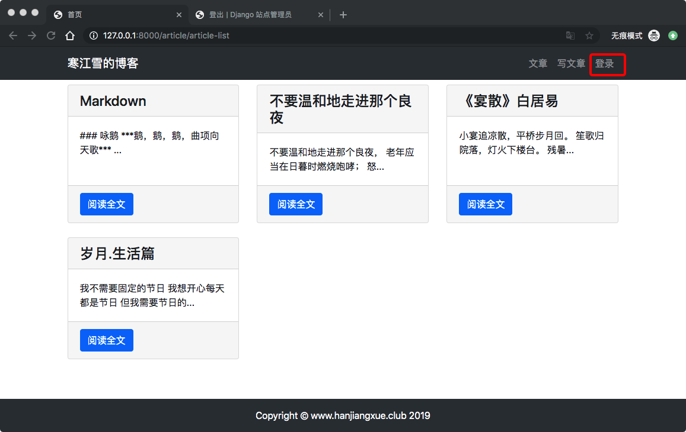
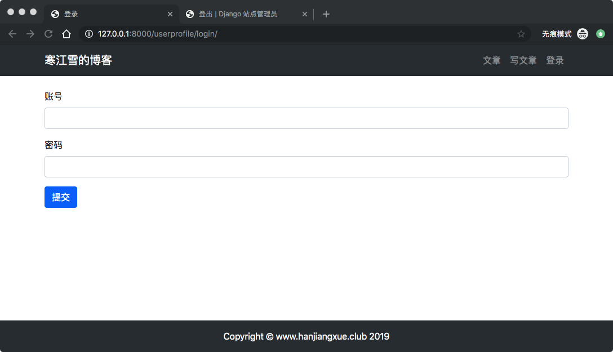
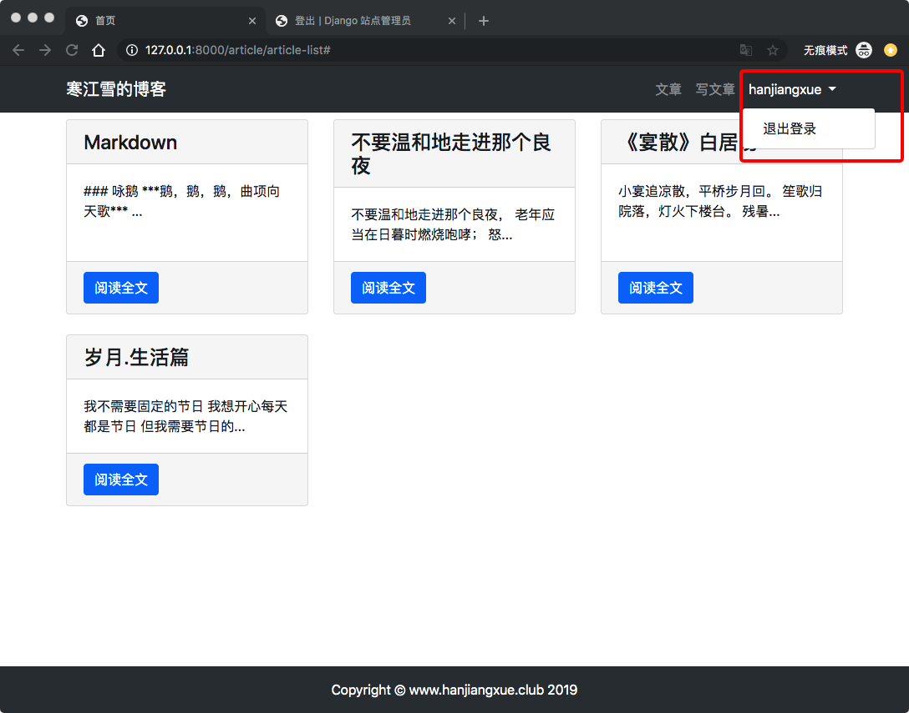

# 7、博客网站搭建七(用户登录和退出)
 
 ## 用户管理
 在Django中用APP来区分不同的功能模块，达到代码的隔离和复用。因为用户管理和博客功能不是一个体系，所有我们需要新建一个APP。进入虚拟环境，运行一下命令，创建新的APP。
 
 	python manage.py startapp userprofile
 	
再次查看目录，发现已经生产了userProfile目录以及其中的文件了。

## 表单类
用户登录时候，需要填写账户密码等表单数据，因此又要用到Form表单类。
在`userprofile`目录中创建表单类文件`forms.py`.写入一下内容：

```
# userprofile/forms.py

# 引入表单类
from django import forms
# 引入User模型
from django.contrib.auth.models import User

# 登录时候继承了forms.Form表单类
class UserLoginForm(forms.Form):
    username = forms.CharField()
    password = forms.CharField()
```

> 在前面的发表文章模块中，表单直接继承了`froms.ModelForm`,这个父类适合需要**直接与数据湖交互**的功能，比如新建、更新数据库的字段等。如果表单江永与直接添加或者编辑Django模型，则可以使用`ModelForm`来避免重复书写字段描述。
> 
> 而`forms.Form`则需要手动配置每个字段，他适合用于不与数据库直接交互的功能，用户登录不需要对数据库进行任何改动，因此直接继承`forms.Form`就可以了。

## 编写视图
用户的登录是比较复杂的功能，好在Django提供了封装好的模块供我们使用。

首先在`userprofile/views.py`中写视图函数：

```

from django.shortcuts import render, redirect
from django.contrib.auth import authenticate, login
from django.http import HttpResponse
from .forms import UserLoginForm


def user_login(request):
    if request.method == 'POST':
        user_login_form = UserLoginForm(data=request.POST)
        if user_login_form.is_valid():
            
            # .clear_data 清晰出合法的数据
            data = user_login_form.cleaned_data
            # 检验账号、密码是否正确匹配数据库中的某个用户
            # 如果均匀匹配则返回这个user对象
            user = authenticate(username=data['username'], password=data['password'])
            if user:
                # 将用户数据保存到session中，即实现了登录操作
                login(request, user)
                return redirect('article:article_list')
            else:
                return HttpResponse('账号或者密码错误，请重新输入~')
        else:
            return HttpResponse('账号或者密码输入不合法')
    elif request.method == 'GET':
        user_login_form = UserLoginForm()
        context = {'form':user_login_form}
        return render(request, 'userprofiles/login.html', context)
    else:
        return HttpResponse('请使用GET或者POST请求数据')
    

```
> * 跟验证文章的表单类似，Form对象的主要任务就检验数据，调用`is_valid()`方法验证并返回指定数据是否有效的布尔值。
> 
> * `Form`不仅负责检验数据，还可以‘清洗’它：将其标准化为一致的格式，这个特性使得它允许以各种方式输入特定字段的数据，并且始终产出一致的输出。一旦`Form`使用数据了一个实例，并对其进行验证，就可以通过`clean_data`属性访问清洗之后的数据。
> 
> * `authenticate()`方法验证用户名称和密码是否匹配，如果是，则将这个用户数据返回。
> 
> * `login()`方法实现用户登录，将用户数据保存在session中。
> 
> 其他内容就跟发表文章类似了

### 什么是session
Session在网络应用中，称为“会话控制”，它存储特定用户会话所需的属性及配置信息。

当用户在 Web 页之间跳转时，存储在 Session 对象中的变量将不会丢失，而是在整个用户会话中一直存在下去。

Session 最常见的用法就是存储用户的登录数据。

详细解释：[session维基百科](https://zh.wikipedia.org/wiki/%E4%BC%9A%E8%AF%9D_(%E8%AE%A1%E7%AE%97%E6%9C%BA%E7%A7%91%E5%AD%A6))

## 登录模板
创建`templates/userprifile/login.html`模板：

```





登录



<div class="container">
    <div class="row">
        <div class="col-12">
            <br>
            <form method="post" action=".">
                
{#                账号#}
                <div class="form-group">
                    <label for="username">账号</label>
                    <input type="text" class="form-control" id="username" name="username">
                </div>
                
{#                密码#}
                <div class="form-group">
                    <label for="password">密码</label>
                    <input type="text" class="form-control" id="password" name="password">
                </div>
{#                提交按钮#}
                <button type="submit" class="btn btn-primary"> 提交</button>
            </form>
        </div>
    </div>
</div>
    

```
> 内容与使用Form表单发表新文章类似。唯一的新知识就是密码表单的`type=‘password’`。可以让输入密码的时候显示小圆点，避免有人偷窥。

下面修改一下`templates/header.html`,把登录按钮加进去。

```
...
...
{#                写文章#}
                <li class="nav-item">
                    <a class="nav-link" href="">写文章</a>
                </li>
{#                使用Django的if模板语句#}
                
{#                如果用户已经登录，则显示用户名下拉框#}
                <li class="nav-item dropdown">
                    <a class="nav-link dropdown-toggle" href="#" id="navbarDropDown" role="button" data-togglr="dropdown" aria-haspopup="true" aria-expanded="false">
                        {{ user.username }}
                    </a>
                    <div class="dropdown-menu" aria-labelledby="navbarDropDown">
                        <a class="dropdown-item" href="#">退出登录</a>
                    </div>
                </li>
                如果用户未登录
                
                <li class="nav-item">
                    <a class="nav-link" href="">登录</a>
                </li>
                
            </ul>
        </div>
    </div>
</nav>
```
> 这里使用了新的模板语法``,用来判断用户是否已经登录：
> 
> * 如果用户已经登录，则显示一个名字为用户名称的下拉框。
> * 如果用户未登录，则显示‘登录’两个字提醒用户可以点进登录了。
> 
> `is_authenticated`是`model.User`类的属性，用于判断用户是否通过身份验证。

## url及其它设置

创建`userprofile/urls.py`文件：

```
from django.urls import path
from . import views


app_name = 'userprofile'


urlpatterns = [
    # 用户登录
    path('login/', views.user_login, name='login'),
]
```
配置跟路由`myblog/mysite/urls.py`：

```
urlpatterns = [
    ...
    ...
    path('userprofile/', include('userprofile.urls'), namespace='userprofile'),
]

```
他那再在配置`myblog/mysite/setting.py`:

```
INSTALLED_APPS = [
	...
	...
    'article',
    'userprofile',
]
```
因为`userprofile`这个APP并没修改model，所以不用迁移数据：
启动服务，在admin后台中退出登录，然后返回文章列表页,看到：



**点击登录：**





## 用户退出登录
退出登录和前面对应，一样的道理，更简单了：

`进入userprofile/views.py文件`:

```
from django.contrib.auth import authenticate, login, logout

# 用户退出登录
def user_logout(request):
    logout(request)
    return redirect('article:article_list')
```

然后配置`userprofile/urls.py`:

```
urlpatterns = [
    # 用户登录
    path('login/', views.user_login, name='login'),
    # 用户退出
    path('logout/', views.logout, name='logout'),
]
```

我们在登录的时候，已经预留了链接，需要改动`templates/header.html`:

```
...
...
<div class="dropdown-menu" aria-labelledby="navbarDropDown">
       <a class="dropdown-item" href="">退出登录</a>
</div>
...
...
```
刷新页面，退出登录看看效果，你可以的。
