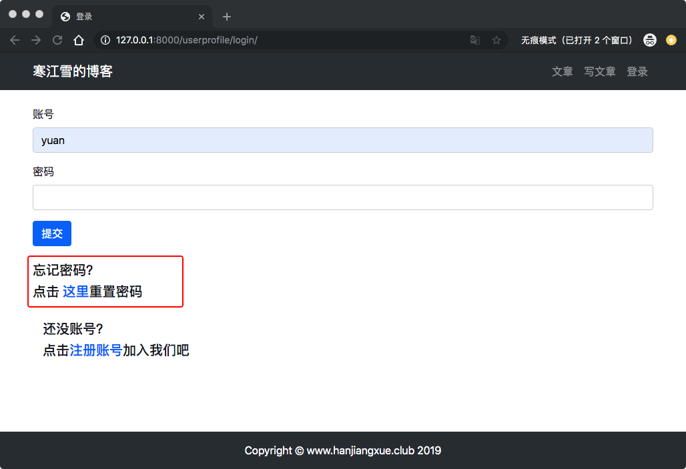
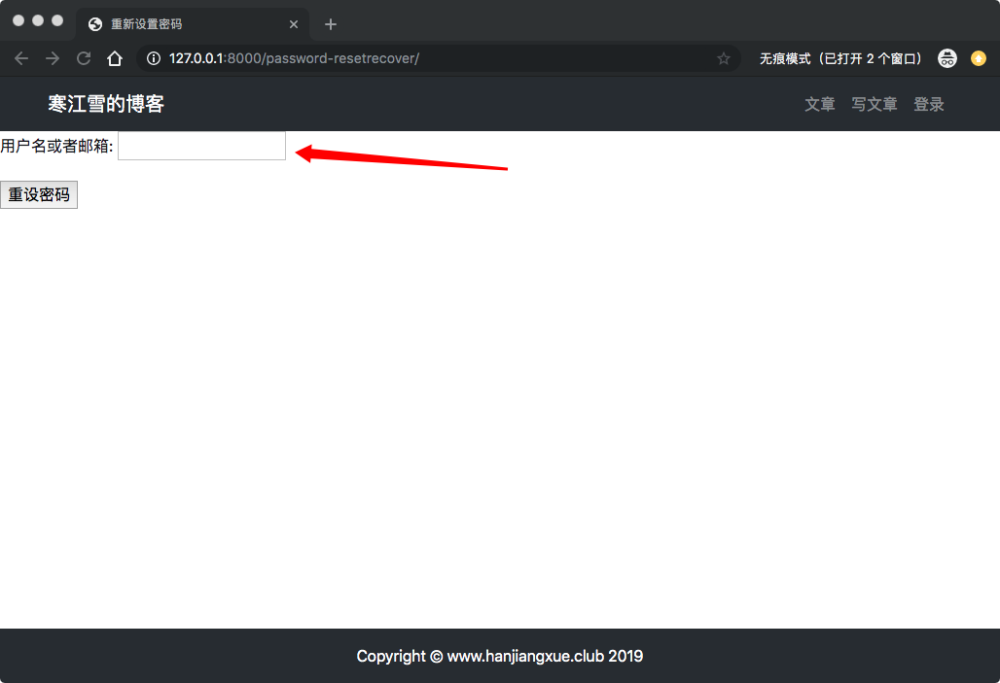
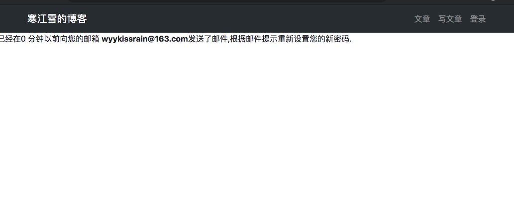
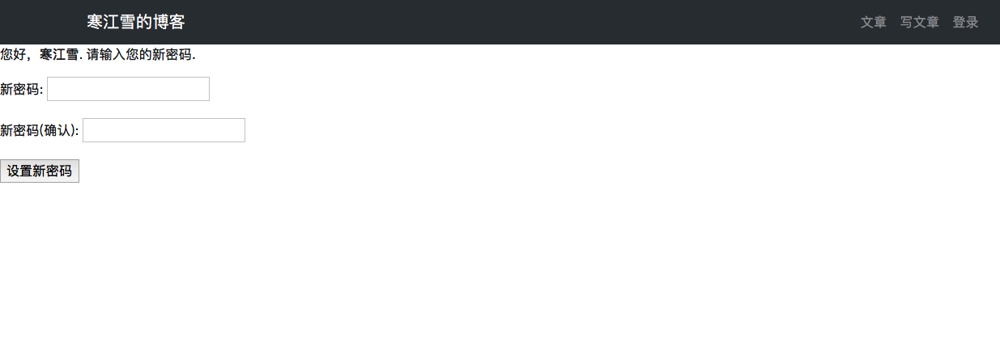
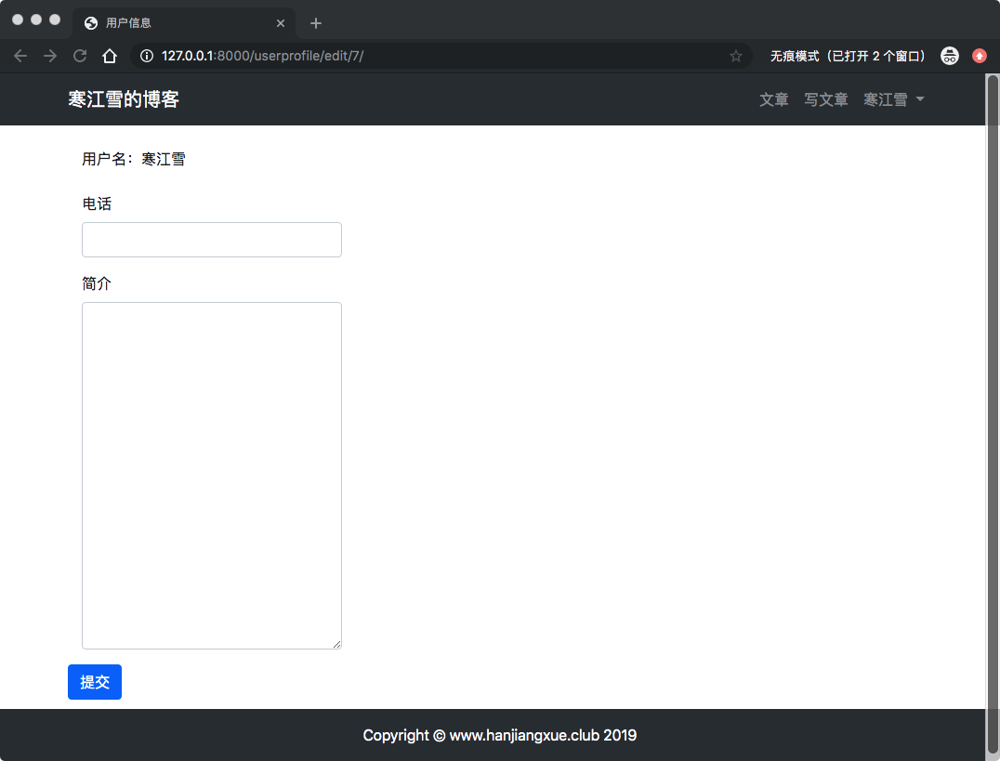
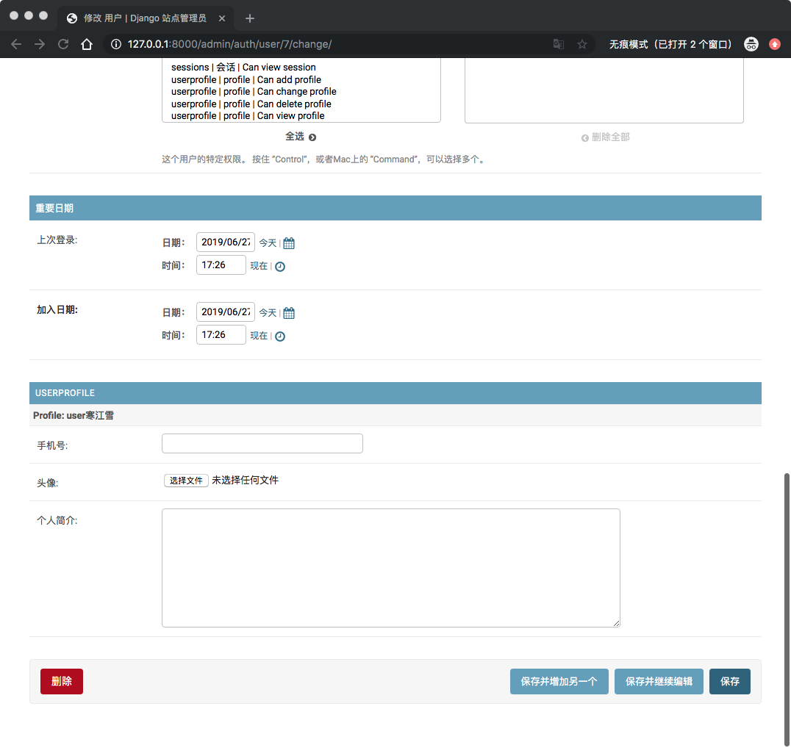
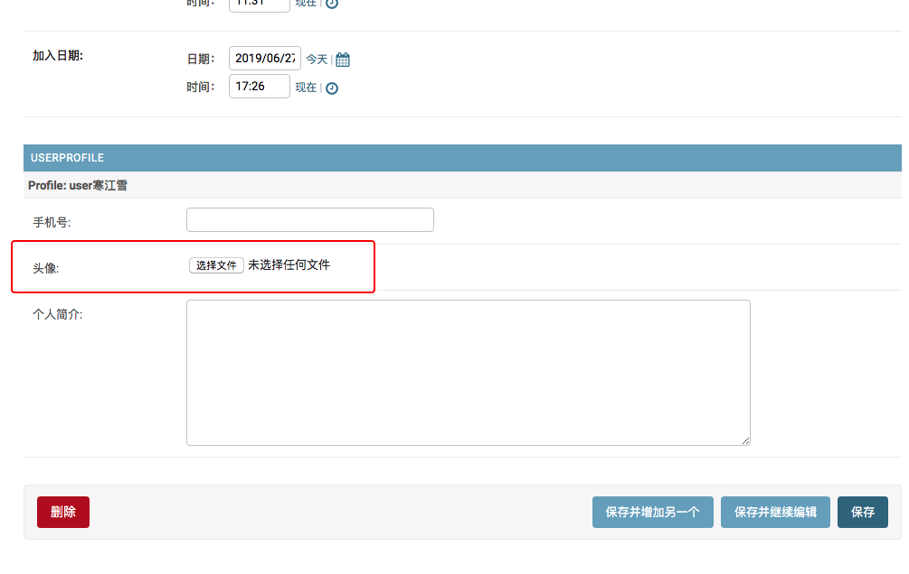

# 9、博客网站搭建九(重置密码、扩展用户信息、上传头像图片)

## 9.1 重置密码
现在用户登录的方式越来越多，指纹，人脸识别，声音，但是呢，密码依然是主要的登录方式，至少目前是的。忘记密码也是很正常的，特别是一些网站你仅仅是看一下就想要你登录，甚至要你手机号，巴拉巴拉一些信息。所以我们现在会有很多账号密码，如果你的所有密码都像我的一样，我的所有密码就两个，所以一般试两下就可以了，但很多人不是的，他们喜欢挑战自己的智商，每个账号一个密码，最后弱智战胜了理智，就有了找回密码。何解？

## 安装第三方库
前面吸怪文章什么的，都是相对比较随意的。但是密码作为用户身份的重要口令。必须以一种更加保险的方式去修改。一般常用的方式是发送一封修改密码的邮件到用户先前绑定的邮箱里。

大概流程如下：

* 向用户邮箱发送包含重置密码地址的邮件，邮件的地址需要动态的生成，防坏人。
* 向网站用户展示一条发送邮件成功的信息。
* 用户点击邮箱中的地址后，转入重置密码的页面。
* 向用户展示；一条重置成功的信息。

Diango内置的木马修改功能就是按照上面的步骤进行的，只要将4步的url配置好就可以了，只是内置模板有点简陋，但是你也可以覆写模板来便成自己的风格。
> 实际上Django不仅内置了密码重置，还包括登录、登出、密码修改等功能。建议读者到一定水平后多阅读Django的源码，学习其中的编程技巧。另外这部分内容Django是用类视图写的，现在阅读可能有一定困难。
> 
> 源码位置：/env/Lib/site-packages/django/contrib/auth/views.py 官方文档：[Django 的验证系统](https://docs.djangoproject.com/zh-hans/2.1/topics/auth/default/)

Django作为优秀的开源框架，有很多第三方库（即APP）被世界各地程序员打包发布到网上，几人已经别人造好了轮子，而且更简单，我们没必要再次建造一个轮子了。

这里有一个第三方库`Django-password-reset`，打开虚拟环境，输入指令：`pip install -U django-password-reset`:


## 快速上手
既然是第三方库也是app，肯定需要在`/myblog/mysite/setting.py`里面注册：

```
import password_reset # 导入

INSTALLED_APPS = [
  ...
  ...
    'password_reset',
]
```
然后进入跟路由`myblog/mysite/urls.py`,添加APP路由：

```
urlpatterns = [
...
...
    path('password-reset', include('password_reset.urls')),
]
```

修改`templates/userprofile/login.html`，提供一个重置密码的入口：

```
...
...
            </form>
            <br>
            <h5>忘记密码？</h5>
            <h5>点击<a href=""> 这里</a>重置密码</h5>
        </div>
...
...
```
邮件不能凭空产生，目前为止欧文还没有配置发送邮件的账号密码，也没有配置发送邮件的端口、发件人信息等。

因此还需要进入`mysite/setting.py`末尾添加发送邮件的相关配置：

```
...
...
# SMTP服务器，改为你邮箱的SMTP
EMAIL_HOST = 'smtp.163.com'
# 改为你自己的邮箱名
EMAIL_HOST_USER = 'wyykissrain@163.com'
# 你的邮箱密码，这里是授权码，不是你邮箱的密码
EMAIL_HOST_PASSWORD = '客户端授权密码时会设置授权码'
# 发送邮件的端口
EMAIL_PORT = 587
# 是否使用TLS
EMAIL_USE_TLS = True
# 默认的发件人
DEFAULT_FROM_EMAIL = '寒江雪的博客<wyykissrain@163.com>'

```


邮箱|发件服务器|非SSL协议端口|SSL协议端口
----|-----|------|------|
163 | smtp.163.com | 25| 465/587
qq  | smtp.qq.com  | 25 |465/587

> 以163邮箱为例，在开启POP3/SMTP服务，并开启客户端授权密码时会设置授权码，将这个授权码放到密码那里
> 
> 简单邮件传输协议<Simple Mail Transfer Protocol SMTP>是在Internet传输mail的协议标准。
> 
> SMTP是基于文本的协议，在气质上指定了一条消息或者多个接受者，然后消息文本会被传输，SMTP使用TCP端口25.
> 
> SMTP是一个'推'的协议（发送邮件），它不允许从远程服务器上‘拉’取消息（接受邮件）。要接收邮件，客户端必须使用POP3或者IMAP。

设置好以后，我们开启服务测试：

点击登录页面；




**然后进入你的邮箱，查看邮件**


**进入链接之后，点击重新设置密码**




## 9.2 扩展用户信息
Django自带的用户管理基本完善，我们并没有写任何模型，但是Django自带毕竟字段田少，比如手机号、头像等都没有，解决的方法很多，你可以不适用user可以自己重新自定义从零开始，也可以对User模型进行扩展，对于博客网站来说，我们需求不复杂，扩展一下就足够了。

进入`userprofile/models.py`如下：

```
from django.db import models
from django.contrib.auth.models import User


# 用户扩展信息
class Profile(models.Model):
    # 与User模型构成一对一关联
    user = models.OneToOneField(User, on_delete=models.CASCADE, related_name='profile')
    # 电话号码字段
    phone = models.CharField(max_length=20,blank=True,verbose_name='手机号')
    # 头像
    avatar = models.ImageField(upload_to='avatar/%Y%m%d/', blank=True, verbose_name='头像')
    # 个人简介
    bio = models.TextField(max_length=500,blank=True, verbose_name='个人简介')

    def __str__(self):
        return 'user{}'.format(self.user.username)


```
> * 每个profile模型对应的唯一一个User模型，形成了对User的外接扩展，因此你可以在Profile添加任何想要的字段。这种方法的好处是不需要对User进行任何的改动，从而拥有自定义的字段。


## 重建数据库
前面说过，每次修改模型后都需要进行数据的迁移。由于`avatar`字段为图像字段，需要安装三方库`Pillow`来支持,`pip install Pillow` 然后进行数据迁移`python manage.py makemigrations`,`python manage.py migrate`如下图：


此时重新登录会出现错误：


> 这是因为之前创建的User数据没有对应的profile模型，违背了现有的模型，粗暴的解决办法就是直接删除原有旧数据，因此需要用到Django的shell命令。
> 
> Shell是Django提供的互动解释器，可以在这个指令模式中实验代码是否正确执行，是很方便的一个工具。


在虚拟环境输入`python mange.py shell`就可以进入sehll了，然后输入命令删除所有数据：


> Attention: 前面写`article`模型中，与User的外键也采用`Model.CASCADE`级联删除模式，因此随着User的删除，相关的文章也一并删除了。
> 
> 输入`exit()`退出shell，输入指令从新创建超级管理员账户：`python manage.py createsuperuser`.
> 
> ***对新手来说，修改数据库经常会导致各种头疼的问题，比如说字段失效、新字段为null、赋值错误、外键链接出错等等，最终导致整个业务逻辑报错。因此我的建议是，在设计数据库时尽量考虑周全，避免频繁修改模型。如果实在要修改，并且已经导致数据库混乱了，不妨删除掉/app/migrations/目录下最新的几个文件，清空相关数据库，重新迁移数据.***

## 表单、视图、模板
有了扩展的Profile模型之后，需要新建一个表单类去编辑它的内容：进入`userprofile/forms.py`:

```
from .models import Profile
...

...
...
# 扩展字段
class ProfileForm(forms.ModelForm):
    class Meta:
        model = Profile
        fields = ('phone', 'avatar', 'bio')

```

然后进入`userprofile/views.py`:

```
# 编辑用户信息
...
from .forms import ProfileForm
from .models import Profile

...
...
@login_required(login_url='/userprofile/login/')
def profile_edit(request, pk):
    user = User.objects.get(pk=pk)
    
    if Profile.objects.filter(user_id=pk).exists():
        profile = Profile.objects.get(user_id=pk)
    else:
        profile = Profile.objects.create(user=user)

    if request.method == 'POST':
        # 验证修改数据者，是否为本人
        if request.user != user:
            return HttpResponse('你没有权限修改此用户信息。')
         
        profile_form = ProfileForm(data=request.POST)
        if profile_form.is_valid():
            # 取得清洗后的合法数据
            profile_cd  =profile_form.cleaned_data
            profile.phone = profile_cd['phone']
            profile.bio = profile_cd['bio']
            profile.save()
            # 带参数的 redirect()
            return redirect('userprofile:edit', pk=pk)
        else:
            return HttpResponse('注册表单输入有误。请重新输入~')
    
    elif request.method == 'GET':
        context = {'profile':profile, 'user':user}
        return render(request, 'userprofile/edit.html', context)
    else:
        return HttpResponse('请使用GET或者POST请求数据')
```
> `user_id`是外键自动生成的字段，用来表示数据表的关联。你可以在DB Brower中查看

然后再`templates/userprofile/`里面新建`edit.html`文件：

```




用户信息



<div class="container">
    <div class="row">
        <div class="col-12">
            <br>
            <div class="col-md-4">用户名：{{ user.username }}</div>
            <br>
            <form method="post" action=".">
                
                
{#                phone#}
                <div class="form-group col-md-4">
                    <label for="phone">电话</label>
                    <input type="text" class="form-control" id="phone" name="phone" value="{{ profile.phone }}">
                </div>
                
{#                bio#}
                <div class="form-group col-md-4">
                    <label for="bio">简介</label>
                    <textarea type="text" class="form-control" id="bio" name="bio" rows="15">{{ profile.bio }}</textarea>
                </div>
                
{#                提交按钮#}
                <button type="submit" class="btn btn-primary">提交</button>
            </form>
        </div>
    </div>
</div>


```
> 文本中通过`value`有些设置了初始值，而多行文本直接设置`{{ profile.bio }}`

最后配置路由：

```
urlpatterns = [
 ...
 ...
    # 编辑用户
    path('edit/<int:pk>/', views.profile_edit, name='edit'),
]
```
启动服务，输入地址，因为用户都被我们删除了，id=1的用户已经没有了，所以自己再注册一下用户：


页面是简陋了点，后面再优化，先跑起来再说。进入`templates/header.html`，添加一个入口:

```
    <li class="nav-item dropdown">
...
...
                        <a class="dropdown-item" href="#" onclick="user_delete()">删除用户</a>
                        <a class="dropdown-item" href=""></a>
                    </div> 
```

## 修改article视图
在前面的article的章节中，由于没有用户管理知识，所以存在一些问题：

* `new_article.author = User.objects.get(pk=1)`强行把用户指定为id=1这显然是有问题的。
* 没有对用户登录状态进行检查

进入`article/views.py`进行如下修改;

```
# 写文章的视图
@login_required(login_url='/userprofile/login/')
def article_create(request):
 ...
 ...
            # 此时请重新创建用户，并出入此用户的id
            new_article.author = User.objects.get(id=request.user.pk)
            
            ....
# 删除文章
@login_required(login_url='/userprofile/login/')
def article_delete(request, pk):
...
...


# 编辑文章
@login_required(login_url='userprofile/login/')
def article_update(request, pk):
...
...

```

## 配置admin
前面我们已经尝试将`article`配置到admin后台，方法是非常简单的，直接在`admin.py`中写入`admin.site.register(Profile)`就可以了，但是这样会导致我们`User`，`Profile`是两个分开的表，这样是不能忍受的呢。

我们希望能能够在admin中，将`User`,`Profile`是合并在一起的一张完整的表。方法如下：进入`userprofile/admin.py`修改如下：

```
from django.contrib import admin
from django.contrib.auth.admin import UserAdmin as BaseUserAdmin
from django.contrib.auth.models import User
from .models import Profile


# 定义一个行内 admin
class ProfileInline(admin.StackedInline):
    model = Profile
    can_delete = False
    verbose_name_plural = 'UserProfile'


# 将 Profile 关联到User中
class UserAdmin(BaseUserAdmin):
    inlines = (ProfileInline,)


# 重新注册User
admin.site.unregister(User)
admin.site.register(User, UserAdmin)

```
启动服务，进入用户进入详情：发现Profile的数据已经堆在了最底部了。



## 9.3上传用户头像
图片属于一种媒体文件，它与静态文件类似，需要设置一个统一的目录，便于集中存储和访问。

这类需要框架统一设置参数，进入`mysite/setting.py`:

```
...
MEDIA_URL = '/media/'
MEDIA_ROOT = os.path.join(BASE_DIR, 'media/')
```
> MEDIA_ROOT和MEDIA_URL用于用户上传文件保存、访问的位置。
> 
> * 在前面Profile中我们设置了upload_to的参数。有了这个参数，文件上传后将自动保存到我们的根目录media文件夹中。os.path.join()指定了media文件夹的位置。
> * MEDIA_URL代表用户通过url来访问这个本地的地址url。设置好这个参数后，用户就可以通过解析url，很方便的获取文件的地址。这个好处避免硬编码，更容易维护。

Django框架擅长的是对逻辑的出来了，而对于图片这类文件的处理则非常的耗时，因此在生产环境中，通常有专门的web服务器来处理文件的访问。

在开发阶段我们不会在意效率的问题，所以Django也提供了方法，让开发服务器能够处理图片。

进入`mysite/urls.py`添加：

```
from django.conf import settings
from django.conf.urls.static import static

urlpatterns = [
...
...
]

urlpatterns += static(settings.MEDIA_URL, document_root=settings.MEDIA_ROOT)

```
>这样就为以后上传图片配置好了路径。


## 编写MTV(Model,Templates,Views)
回顾一下，avatar的字段前面已经写好了：

```
# /userprofile/models.py
...
class Profile(models.Model):
	...
	avatar = models.ImageField(upload_to='avatar/%Y%m%d/', blank=True)
	...
```

`upload_to`指定了图片上传的位置，，即`/media/avatar/%Y%m%d`.`%Y%m%d`是日期的固定写法，最终会格式化为系统时间。
> `ImageField`字段不会存储图片本身，而仅仅保存图片的地址

表单类也在前面写好了，不用修改：

```
...
# 扩展字段
class ProfileForm(forms.ModelForm):
    class Meta:
        model = Profile
        fields = ('phone', 'avatar', 'bio')

...
```
接着需要修改视图，使之能够对图片进行处理，进入`userprifile/views.py`：

```
        profile_form = Profile(request.POST, request.FILES) # 修改
        if profile_form.is_valid():
            # 取得清洗后的合法数据
            profile_cd = profile_form.cleaned_data
            profile.phone = profile_cd['phone']
            profile.bio = profile_cd['bio']
            if 'avatar' in request.FILES   # 新增
                profile.avatar = profile_cd['avatar']
            profile.save()
            # 带参数的 redirect()
            return redirect('userprofile:edit', pk=pk)
```
> * 表单上传的文件对象存储在类字典对象`requrst.FILES`中，因此需要修改表单类的参数，将他一并传过去。
> * 如果`request.Files`中存在键Wie`avatar`的元素，则将其赋值给`profile.avatar`(注意保存图片地址)，否则不予处理。

修改模板文件，添加代码显示、处理用户的头像，进入/templates/userprofile/edit.html:

```
....
...
            <div class="col-md-4">用户名：{{ user.username }}</div>
            <br>
            
                <div class="col-md-4">头像</div>
                
            
                <h5 class="col-md-4">暂无头像</h5>
            
            <br>
            <br>
            <form method="post" action="." enctype="multipart/form-data">
                
{#                上传头像#}
                <div class="form-group">
                    <label for="avatar">上传头像</label>
                    <input type="file" class="form-control-file" name="avatar" id="avatar">
                </div>
                ....
                ...
```
> * 模板语法``判断用户是否上传头像
> * ``标签用于显示图片内容：在`style`属性中规定了图片的最大尺寸并带有一点圆角
> * 注意表单必须设置`enctype='multipart/form-data'`属性，才能够正确上传图片等文件。
> * 添加`<input type='file' ..>`标签用于上传图片。

启动服务，刷新用户页面信息：




>查看一下项目目录，生成了新的文件夹media/avatar/20190701/，其中存储了该头像文件；在DBBrowser中查看avatar字段，其保存的是文件的url地址。
>
>更改图片仅仅会改变字段中存储的url，并不会真正删除图片本身。因此在处理大容量文件时要小心，需要额外的方法进行清理。